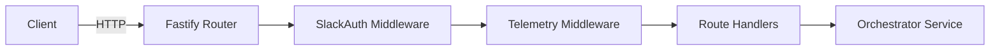
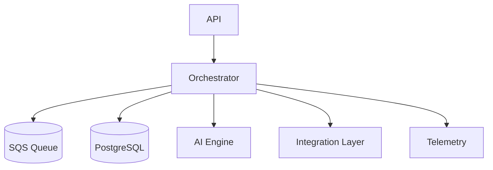
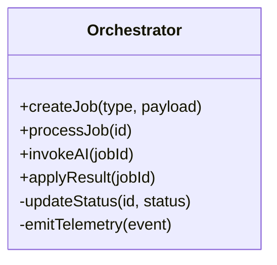
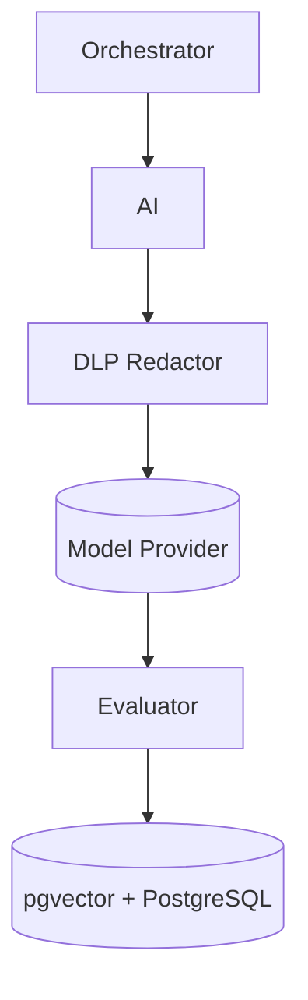
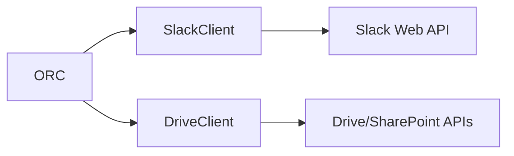
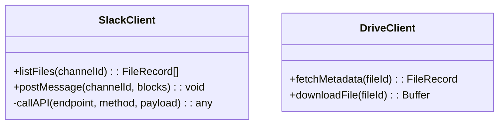
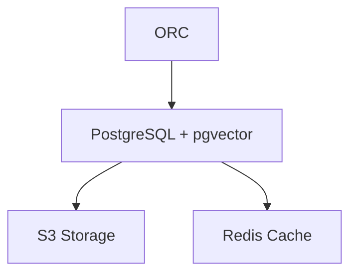
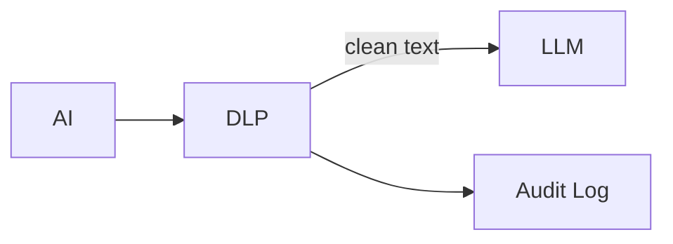

# Backend Modules  
**Project 4 — Backend Development (CMU 17-316/616)**  
**Authors:** Akeil Smith, Lexi Kronowitz, Miguel Almeida  
**Version/Date:** v1.0 — 2025-10-21  

---

## Overview  

This document defines the detailed backend module specifications for the unified backend that supports both user stories:  

- **User Story 1:** AI-Generated Slack Workspace Structure  
- **User Story 2:** Centralized AI-Linked Project File Hub  

Each module specification below includes:  
1. Features and limitations  
2. Internal architecture (text + Mermaid diagram)  
3. Data abstractions and representation invariants  
4. Stable storage and schema definitions  
5. External API (REST or internal)  
6. Class declarations and visibility  
7. Design justification  

---

## 1. API Gateway / Fastify Server  

### Features  
**Can do:**  
- Authenticate Slack requests via signing secrets  
- Route events and internal REST calls to appropriate controllers  
- Handle logging, telemetry, and input validation  
- Return standardized JSON responses  

**Cannot do:**  
- Perform core business logic (delegated to Orchestrator)  
- Access or modify the database directly  

### Internal Architecture  


### Data Abstraction  
- **Request Object:** Encapsulates HTTP headers, Slack payload, and request context.  
- **Invariant:** All Slack events must include a valid signature and timestamp; malformed requests are rejected before routing.  

### Stable Storage  
The API Gateway is stateless; it relies on Orchestrator for persistence.  

### Public API (REST)  
| Method | Path | Description |
|---------|------|-------------|
| `POST` | `/slack/events` | Handles Slack event callbacks |
| `POST` | `/slack/interactions` | Processes modals and button interactions |
| `GET` | `/structure/jobs/:id` | Fetches job status |
| `GET` | `/files/search` | Returns search results |

### Class Outline  
```typescript
class ApiGateway {
  +start(): void
  +registerRoutes(): void
  -verifySlackSignature(req): boolean
  -errorHandler(err): void
}
```
**External:** `start`, `registerRoutes`  
**Private:** `verifySlackSignature`, `errorHandler`  

### Justification  
A lightweight API Gateway ensures scalability through AWS Lambda, keeping it stateless and fast for concurrent connections.  

---

## 2. Orchestrator Service  

### Features  
- Coordinates job creation, AI processing, file synchronization, and Slack updates  
- Manages workflows for both user stories  
- Handles retries, logging, and telemetry  

### Internal Architecture  


### Data Abstraction  
- **Job:** (`id`, `type`, `status`, `createdAt`, `updatedAt`, `payload`)  
- **Invariant:** Job must always have one valid state from `{created, running, failed, done}`  

### Stable Storage  
Jobs stored in `structure_jobs` and `file_sync_jobs` tables; messages are persisted in SQS for reliability.  

### Internal API  
| Method | Params | Description |
|---------|---------|-------------|
| `createJob(type, payload)` | Initializes and stores new job |
| `processJob(id)` | Executes job lifecycle |
| `invokeAI(jobId)` | Delegates to AI Engine |
| `recordTelemetry(event)` | Emits performance metrics |

### Class Diagram  


### Justification  
Central orchestration ensures consistent workflow management, atomic job transactions, and easy debugging.  

---

## 3. AI Engine  

### Features  
- Generates workspace structures or file tags/embeddings via LLMs  
- Validates responses using JSON schema  
- Applies heuristic and scoring layers  

### Internal Architecture  


### Data Abstraction  
- **AIResult:** (`id`, `jobId`, `version`, `score`, `payload`, `timestamp`)  
- **Invariant:** Each AIResult must match one `jobId` and schema.  

### Stable Storage  
Proposals stored in `proposals`; embeddings persisted in `pgvector`.  

### API  
| Method | Description |
|---------|-------------|
| `generateStructure(intake)` | Returns structure proposal JSON |
| `tagAndEmbed(files)` | Returns tag arrays and embeddings |
| `evaluateResult(proposal)` | Returns quality score |

### Classes  
```typescript
class AIEngine {
  +generateStructure(intake: IntakeForm): StructureProposal
  +tagAndEmbed(files: File[]): FileEmbedding[]
  -validateJSON(payload): boolean
  -redactPII(text): string
}
```

### Justification  
Abstracting AI logic ensures vendor-agnostic integration and reproducibility across LLMs while enforcing schema safety.  

---

## 4. Integration Layer  

### Features  
- Interfaces with Slack Web API and Drive/SharePoint connectors  
- Fetches workspace data and posts Slack messages  
- Manages retry logic and pagination  

### Architecture  


### Data Abstraction  
- **SlackContext:** (`channels`, `users`, `groups`, `usageSignals`)  
- **FileRecord:** (`externalId`, `source`, `url`, `tags[]`)  

### Stable Storage  
Metadata cached in Redis; persisted in PostgreSQL for audit.  

### API  
| Method | Description |
|---------|-------------|
| `fetchWorkspace(teamId)` | Returns workspace metadata |
| `listFiles(channelId)` | Lists files |
| `postMessage(channel, blocks)` | Posts interactive Slack messages |

### Class Diagram  


### Justification  
Encapsulating integrations simplifies orchestration and enables mocking for safe local testing.  

---

## 5. Database & Storage Layer  

### Features  
- Provides unified persistence for all backend modules  
- Supports relational and vector storage  
- Enforces foreign-key integrity  

### Architecture  


### Data Abstraction  
- Relational tables: `workspaces`, `jobs`, `proposals`, `files`, `embeddings`  
- **Invariant:** Every record has a valid `workspace_id` foreign key.  

### Stable Storage  
- PostgreSQL (AWS RDS)  
- S3 (Artifacts)  
- Redis (Cache)  

### API  
| Method | Description |
|---------|-------------|
| `saveJob(job)` | Persists job |
| `getJob(id)` | Retrieves job |
| `saveEmbedding(vec)` | Stores embedding vector |
| `fetchFiles(workspaceId)` | Returns workspace files |

### Justification  
Centralized schema simplifies cross-feature analytics and consistency.  

---

## 6. Policy & DLP Layer  

### Features  
- Redacts personal data before LLM requests  
- Validates outputs against corporate rules  
- Audits blocked requests  

### Architecture  


### Data Abstraction  
- **Policy:** (`id`, `type`, `rules[]`)  
- **ValidationResult:** (`valid`, `issues[]`)  

### API  
| Method | Description |
|---------|-------------|
| `redact(text)` | Removes PII |
| `validate(proposal)` | Checks compliance |
| `audit(entry)` | Logs violations |

### Classes  
```typescript
class PolicyService {
  +redact(text): string
  +validate(proposal: StructureProposal): ValidationResult
  +audit(log: string): void
}
```

### Justification  
Ensures enterprise-grade security, compliance, and traceability for all AI interactions.  

---

## Summary  

This backend design maintains modularity, strong abstractions, and AWS compatibility. Each module has isolated responsibilities, clear interfaces, and built-in security, supporting 10 simultaneous users while ensuring maintainability and testability.

---
