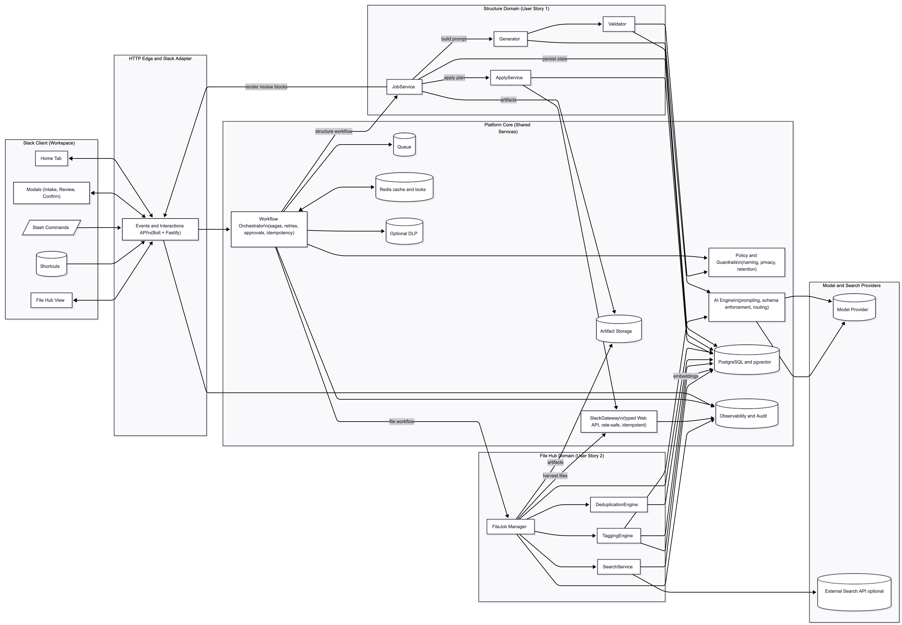

# Single Unified Architecture

This diagram shows how all parts of the system connect together. Slack users interact with the system through the Home Tab, Modals, Shortcuts, Slash Commands, and the File Hub view. All those inputs go through a single gateway called the Slack Events and Interactions API. That gateway connects to a central platform that manages everything the system does. The platform includes an Orchestrator that runs the workflows, a Policy service that checks for naming and privacy rules, an AI Engine that creates and validates content, and a Slack Gateway that safely sends data back to Slack. The data layer includes PostgreSQL with pgvector for storing information and search indexes, Redis for quick caching and locking, S3 for saving files and artifacts, and tools for logging and observability. There are two main application areas. The first one is the Structure Domain, which builds and applies organized Slack workspace structures. The second one is the File Hub Domain, which collects, tags, and makes project files easy to find. Both of these areas use the same shared platform.

The key idea behind this design is that everything passes through one reliable core instead of building separate systems for each feature. By sharing the Orchestrator, Policy, AI Engine, and Slack Gateway, we can reuse the same logic for retries, validation, approvals, and error handling. This helps keep the code simpler and easier to maintain. Each domain focuses only on its specific work and uses the shared tools to do so. The Slack Gateway ensures all operations are safe, rate-limited, and recoverable if something fails. Using PostgreSQL and pgvector gives us both structured data storage and advanced search, while Redis and the Queue help balance the load. This setup is simple enough for small teams now but is modular enough to grow into separate services later if needed.

LLM (GPT 5) Chatlog: https://chatgpt.com/share/68f9750e-3bac-800a-8ec6-d6ffefd4276c 
