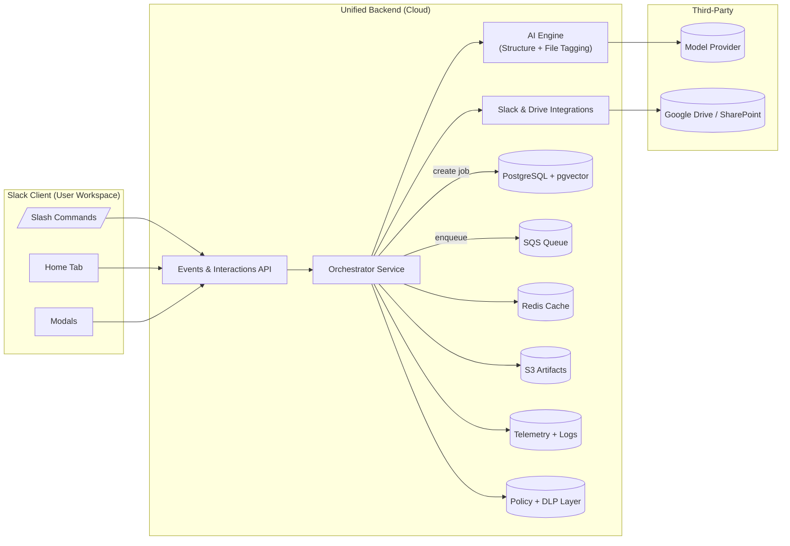

# 2. Specify the Backend

## Architecture

### 2.1 Overview

The unified backend supports both user stories: **AI-Generated Slack Workspace Structure** and **Centralized AI-Linked Project File Hub**. It consolidates orchestration, AI processing, data storage, and integration services into a single backend. This ensures consistent data models, shared telemetry, and reduced duplication.

The backend is an event-driven system built in **TypeScript (Node.js 20)** using **Fastify**, **AWS Lambda**, **PostgreSQL (pgvector)**, **Redis**, and **S3**. It communicates with Slack and third-party storage (Google Drive, SharePoint) through secure API gateways. Both user stories interact with the same backend through Slack events and modals, ensuring a unified workspace context.

---

### 2.2 Detailed Component Description

| Component | Description | Responsibilities | Key Technologies |
|------------|-------------|------------------|------------------|
| **API Gateway / Fastify Server** | Entry point for Slack and REST requests | Routes `/slack/events`, `/slack/interactions`, `/structure/*`, `/files/*`; performs authentication and request validation | Fastify, Bolt SDK |
| **Orchestrator Service** | Core controller for jobs and workflows | Creates and tracks jobs, invokes AI Engine, manages persistence, and coordinates external APIs | Node.js, AWS Lambda |
| **AI Engine** | Shared AI layer for structure generation and file tagging | Invokes LLMs via secure APIs, handles embeddings, deduplication, and tagging | GPT-4-class models, JSON schema validation |
| **Integration Layer** | Interfaces with Slack and external drives | Fetches workspace context, uploads results, handles rate limits and retries | Slack Web API, Google Drive SDK |
| **Database (PostgreSQL + pgvector)** | Main persistence and vector search | Stores all workspaces, jobs, proposals, files, embeddings, and feedback | AWS RDS PostgreSQL 16 |
| **Queue (SQS)** | Asynchronous job queue | Manages rate-limited Slack and embedding jobs; ensures reliable background task execution | AWS SQS |
| **Cache (Redis)** | Volatile storage for transient data | Stores temporary sessions, modal state, and rate-limit locks | AWS Elasticache Redis |
| **Object Storage (S3)** | Artifact storage | Stores prompts, proposals, logs, diffs, extracted text, and previews | AWS S3 |
| **Telemetry (OpenTelemetry + CloudWatch)** | Observability and monitoring | Tracks performance, latency, errors, and logs | OpenTelemetry, AWS CloudWatch |
| **Policy & DLP Layer** | Security and compliance service | Redacts PII, validates naming policies, ensures compliance | Node microservice, AWS Lambda |

---

### 2.3 Data Flow Narrative

1. **Trigger** – A user invokes `/autostructure` or `/filehub` in Slack.
2. **API Gateway** – The request is validated and passed to the Orchestrator.
3. **Job Creation** – The Orchestrator creates a `StructureJob` or `FileSyncJob` record in PostgreSQL.
4. **Queue Dispatch** – The job ID is enqueued in SQS for asynchronous processing.
5. **Context Harvesting** – A worker retrieves workspace metadata and files through the Integration Layer.
6. **AI Processing** – The AI Engine generates either workspace blueprints or file tags and embeddings.
7. **Persistence** – Results are stored in PostgreSQL and S3; embeddings are added to pgvector.
8. **Slack Interaction** – The Orchestrator updates Slack with modals for review or file search via the Integration Layer.
9. **Telemetry & Logging** – All actions emit observability data to CloudWatch.
10. **Feedback Loop** – User feedback is recorded and used for future evaluations.

---

### 2.4 Mermaid Diagram

---

### 2.5 Design Justification

#### Single Orchestrator Pattern
A centralized orchestrator controls workflows for both user stories, minimizing duplication and ensuring unified logging, retry logic, and telemetry. It allows modular job types while maintaining a single source of truth.

#### Event-Driven Architecture
Slack interactions and AI tasks occur asynchronously through SQS and Redis. This decoupling increases scalability and prevents bottlenecks during Slack rate-limiting.

#### Shared AI Layer
The AI Engine abstracts LLM communication and handles both structure generation and tagging logic through a common schema, ensuring output consistency and shared redaction pipelines.

#### Unified Data Schema
Using PostgreSQL and pgvector enables unified data management for jobs, files, and embeddings while providing semantic search capabilities for both workflows.

#### Security and Compliance
The DLP Layer intercepts all outbound data to the LLM, scrubbing PII and enforcing workspace-level policies. This ensures Slack compliance and enterprise readiness.

#### AWS-Native Deployment
All major services (Lambda, SQS, S3, RDS, CloudWatch) are AWS-native, providing high availability, low operational overhead, and free-tier cost coverage.

---

### 2.6 Scalability & Reliability

- The backend is **stateless**; Redis manages transient sessions.  
- SQS ensures at-least-once delivery and task retry.  
- pgBouncer connection pooling optimizes database access for 10+ users.  
- AI tasks are parallelized through Lambda concurrency.  
- Observability with OpenTelemetry ensures quick fault diagnosis.  

This architecture scales efficiently for **10 concurrent users**, aligns with AWS deployment requirements, and provides a strong foundation for Project 5 integration.

---

