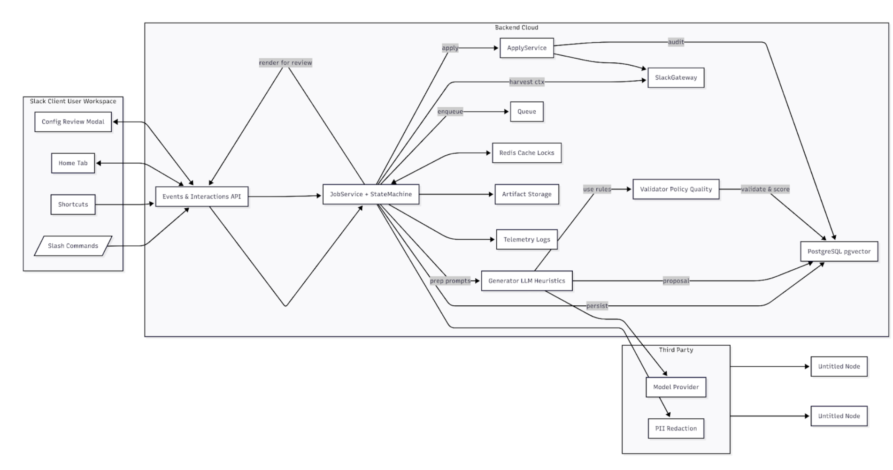
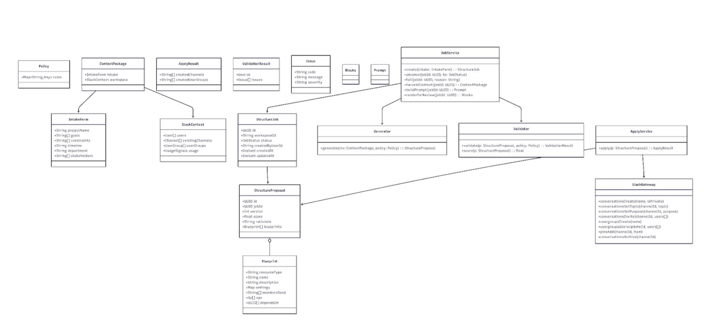
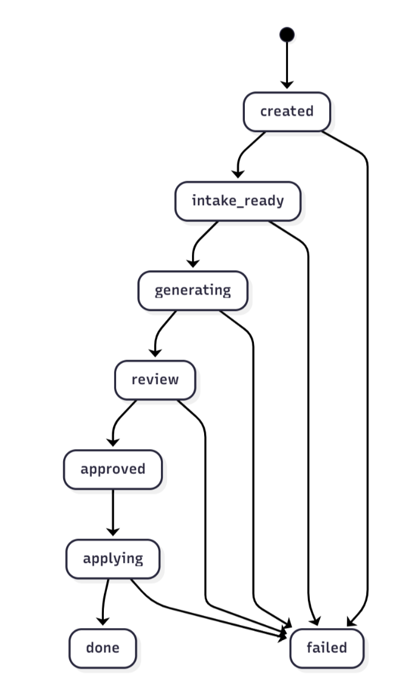
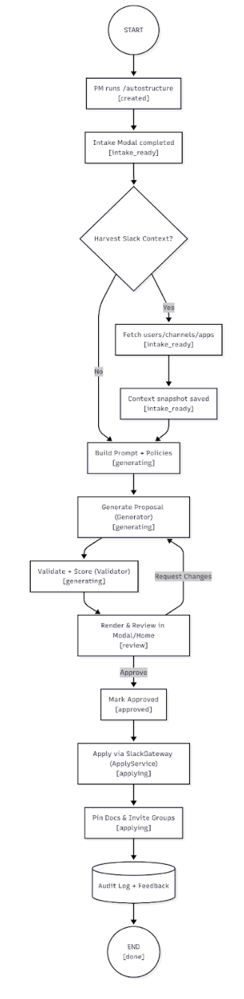
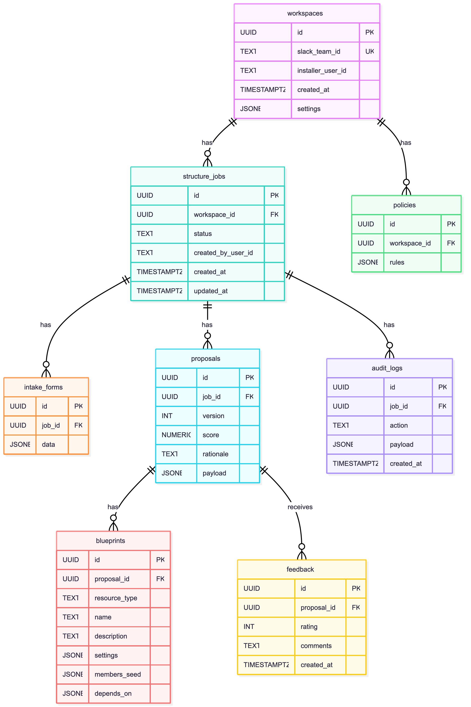

# User Story 1
## 1. Header

Title: AI‑Generated Slack Workspace Structure — Simplified v1 (User Story #1)

Authors: Akeil Smith, Lexi Kronowitz, Miguel Almeida

Version/Date: v2.0 — 2025‑10‑22

User Story: As a project manager, I want Slack to use AI to automatically generate and create an optimized structure for workspaces, channels, and subgroups so that communication is organized, clear, and scalable from the start without requiring manual setup.

Outcome: A Slack app that proposes and applies a best‑practice information architecture (channels, user groups, naming conventions, topics/purposes, and starter workflows) on Day 0, with human‑in‑the‑loop approval.

Primary KPIs: Time to first usable structure (<10 min), % proposals accepted without edits (>60%), channel sprawl reduction after 30 days (≥25%), PM satisfaction (CSAT ≥ 4/5).

## 2. Architecture Diagram

flowchart LR
  subgraph Slack_Client[Slack Client (User Workspace)]
    H[Home Tab]
    M[Config/Review Modal]
    SC[/Slash Commands/]
    SHT[(Shortcuts)]
  end

  subgraph Backend[Backend (Cloud)]
    API[Events & Interactions API]
    JOB[JobService + StateMachine]
    GEN[Generator (LLM + Heuristics)]
    VAL[Validator (Policy + Quality)]
    APP[ApplyService]
    SGW[SlackGateway]
    DB[(PostgreSQL + pgvector)]
    Q[(Queue)]
    	    REDIS[(Redis Cache/Locks)]
    S3[(Artifact Storage)]
    OBS[(Telemetry/Logs)]
  end

  subgraph Third_Party[Third‑Party]
    LLM[(Model Provider)]
    DLP[(PII Redaction)]
  end

  SC --> API
  SHT --> API
  H <--> API
  M <--> API

  API --> JOB
  JOB -->|persist| DB
  JOB -->|enqueue| Q
  JOB -->|harvest ctx| SGW
  JOB -->|prep prompts| GEN
  GEN -->|use rules| VAL
  GEN --> LLM
  GEN -->|proposal| DB
  VAL -->|validate & score| DB
  JOB -->|render for review| API
  API --> JOB
  JOB -->|apply| APP
  APP --> SGW
  APP -->|audit| DB
  JOB --> S3
  JOB --> OBS
  JOB <--> REDIS
  JOB --> DLP
Explanation: Slack surfaces (Home, Modals, slash commands, shortcuts) invoke the Events/Interactions API. JobService orchestrates the run: persisting state, optional context harvest via SlackGateway, prompting the Generator, and calling the Validator to enforce policy and score quality. The PM reviews the proposal; upon approval, ApplyService uses SlackGateway to create resources. Queue smooths rate limits, Redis holds short‑lived state/locks, S3 stores artifacts (prompts, proposals, diffs), and Observability traces the flow. Optional DLP redacts PII in prompts.
Information Flows: Trigger → Intake → Context Harvest → Generation → Validation → Review → Approval → Apply → Audit/Feedback. Each step persists to DB and emits telemetry to OBS.

## 3. Class Diagram

classDiagram
  %% Entities / Value Objects
  class StructureJob {
    +UUID id
    +String workspaceId
    +JobStatus status
    +String createdByUserId
    +Instant createdAt
    +Instant updatedAt
  }

  class StructureProposal {
    +UUID id
    +UUID jobId
    +int version
    +float score
    +String rationale
    +Blueprint[] blueprints
  }

  class Blueprint {
    +String resourceType  // channel | user_group
    +String name
    +String description
    +Map settings         // topic, purpose, privacy, retention
    +String[] membersSeed
    +Op[] ops             // create, invite, set-topic, pin
    +UUID[] dependsOn
  }

  class Policy { +Map~String,Any~ rules }  %% data-only
  class ContextPackage { +IntakeForm intake; +SlackContext workspace }
  class IntakeForm { +String projectName; +String[] goals; +String[] constraints; +String timeline; +String department; +String[] stakeholders }
  class SlackContext { +User[] users; +Channel[] existingChannels; +UserGroup[] userGroups; +UsageSignals usage }
  class ApplyResult { +String[] createdChannels; +String[] createdUserGroups }
  class ValidationResult { +bool ok; +Issue[] issues }
  class Issue { +String code; +String message; +String severity }
  class Blocks
  class Prompt

  %% Services
  class JobService {
    +create(intake: IntakeForm): StructureJob
    +advance(jobId: UUID, to: JobStatus)
    +fail(jobId: UUID, reason: String)
    +harvestContext(jobId: UUID): ContextPackage
    +buildPrompt(jobId: UUID): Prompt
    +renderForReview(jobId: UUID): Blocks
  }

  class Generator { +generate(ctx: ContextPackage, policy: Policy): StructureProposal }
  class Validator {
    +validate(p: StructureProposal, policy: Policy): ValidationResult
    +score(p: StructureProposal): float
  }
  class ApplyService { +apply(p: StructureProposal): ApplyResult }
  class SlackGateway {
    +conversationsCreate(name, isPrivate)
    +conversationsSetTopic(channelId, topic)
    +conversationsSetPurpose(channelId, purpose)
    +conversationsInvite(channelId, users[])
    +usergroupsCreate(name)
    +usergroupsUsersUpdate(id, users[])
    +pinsAdd(channelId, item)
    +conversationsArchive(channelId)
  }

  StructureJob --> StructureProposal
  StructureProposal o-- Blueprint
  ContextPackage --> IntakeForm
  ContextPackage --> SlackContext
  JobService --> StructureJob
  JobService --> Generator
  JobService --> Validator
  ApplyService --> StructureProposal
  ApplyService --> SlackGateway
Explanation: Entities are lean (data‑only) and services have single responsibilities. Policy is a data container; Validator handles both policy enforcement and quality scoring. A single Blueprint type covers channels and user groups via resourceType and typed settings.
## 4. List of Classes

StructureJob — Persistent record of a run; holds status, timestamps, and ownership. No domain logic.

StructureProposal — Versioned proposal with rationale, score, and the list of Blueprints to apply.

Blueprint — Declarative spec for a Slack resource and the idempotent operations (ops) needed to create/configure it.

Policy — Data‑only rules (naming, privacy, retention) consumed by Validator.

ContextPackage — Combines user‑provided intake with harvested workspace metadata for generation.

IntakeForm — Human inputs: scope, goals, constraints, stakeholders, timeline.

SlackContext — Snapshot of users, channels, groups, and usage signals.

ApplyResult — Outputs from the apply phase (ids/names of created resources).

ValidationResult/Issue — Results of policy enforcement and quality checks.

JobService — Sequences the run, manages state transitions, builds prompts, and renders review blocks.

Generator — Produces a proposal from ContextPackage + Policy using LLM + heuristics.

Validator — Enforces policy, detects duplicates/gaps, and computes an overall score.

ApplyService — Executes Blueprint.ops via SlackGateway with retry/backoff and auditing.

SlackGateway — Thin adapter over Slack Web API; no domain logic.

## 5. State Diagram

stateDiagram-v2
  [*] --> created
  created --> intake_ready
  intake_ready --> generating
  generating --> review
  review --> approved
  approved --> applying
  applying --> done
  created --> failed
  intake_ready --> failed
  generating --> failed
  review --> failed
  applying --> failed
Explanation: Jobs progress linearly with a human approval gate. Any state can transition to failed with a reason; retries move back to the prior state.
## 6. Flow Chart

Scenario Label: SC1 — Generate and Apply Workspace Structure (User Story #1)
Prose: A PM starts generation in Slack; the system collects inputs, harvests context, generates a proposal, validates it, presents it for approval, and applies it on approval. Each box maps to the state diagram.

flowchart TD
  start((START)) --> A[PM runs "/autostructure"\n[created]]
  A --> B[Intake Modal completed\n[intake_ready]]
  B --> C{Harvest Slack Context?}
  C -- Yes --> D[Fetch users/channels/apps\n[intake_ready]]
  C -- No --> G[Build Prompt + Policies\n[generating]]
  D --> E[Context snapshot saved\n[intake_ready]]
  E --> G
  G --> H[Generate Proposal (Generator)\n[generating]]
  H --> I[Validate + Score (Validator)\n[generating]]
  I --> J[Render & Review in Modal/Home\n[review]]
  J -- Approve --> JA[Mark Approved\n[approved]]
  JA --> K[Apply via SlackGateway (ApplyService)\n[applying]]
  J -- Request Changes --> H
  K --> L[Pin Docs & Invite Groups\n[applying]]
  L --> M[(Audit Log + Feedback)]
  M --> done((END\n[done]))
Explanation: The flow aligns with the simplified services and the state diagram, including the explicit approved step before applying.
## 7. Development Risks and Failures

Slack API rate limits — Burst creates/invites can hit limits. Mitigation: queue ops, batch invites, exponential backoff, and pre‑flight estimates.

Insufficient permissions/scopes — Missing rights to read users or create resources. Mitigation: guided install with scope rationale; degrade gracefully (e.g., propose only).

Low‑quality proposals — Redundant/non‑compliant channels. Mitigation: policy‑driven validation, curated examples, schema‑constrained outputs, mandatory human approval.

Enterprise Grid complexity — Cross‑workspace/shared channels. Mitigation: v1 targets single workspace; v2 adds Grid mapping and org‑level settings.

Security/PII leakage — Names/emails in prompts. Mitigation: optional DLP, role‑label replacement, minimal retention, auditable access.

Change management — Users surprised by auto‑creation. Mitigation: preview diffs, announcement posts, and rollback/archival of newly created entities.

## 8. Technology Stack

Language/Runtime: TypeScript on Node.js 20

Frameworks: Bolt for Slack (Events/Interactivity), Fastify (REST)

Infra: AWS Lambda + API Gateway (or Cloud Run), SQS, CloudWatch/X‑Ray or OpenTelemetry

Data: PostgreSQL + pgvector, Redis, S3

AI: LLM (GPT‑4‑class), prompt templates, JSON schema enforcement

CI/CD: GitHub Actions, IaC with Terraform

Testing: Jest, Pact (Slack contracts), Playwright (UI flows), k6 (apply‑phase load)

## 9. APIs

Incoming Slack
POST /slack/events — Verifies URL; receives events/app_mentions; routes to command handlers.

POST /slack/interactions — Handles view_submission, buttons, and block actions.

Internal REST
POST /jobs — Body: IntakeForm; creates a StructureJob; returns { jobId }.

GET /jobs/{id} — Returns job status and current proposal if present.

POST /jobs/{id}/harvest — Triggers context harvest; returns ContextPackage summary.

POST /jobs/{id}/generate — Runs Generator; returns StructureProposal (versioned).

POST /jobs/{id}/validate — Runs Validator; returns ValidationResult + score.

POST /proposals/{id}/approve — Marks proposal approved and advances job.

POST /proposals/{id}/apply — Executes ApplyService; returns ApplyResult.

POST /proposals/{id}/feedback — { rating:int, comments:string } stored for tuning.

Service Interfaces (selected methods)
JobService: create(), advance(), fail(), harvestContext(), buildPrompt(), renderForReview().

Generator: generate(ctx, policy).

Validator: validate(proposal, policy) -> ValidationResult, score(proposal) -> float.

ApplyService: apply(proposal) -> ApplyResult.

SlackGateway: conversationsCreate, conversationsSetTopic, conversationsSetPurpose, conversationsInvite, usergroupsCreate, usergroupsUsersUpdate, pinsAdd, conversationsArchive.

## 10. Public Interfaces

Slash Command /autostructure

Request: { team_id, user_id, channel_id, text }

Behavior: Opens Intake Modal; creates job on submit.

Shortcut: “Generate structure from thread”

Request: { message_ts, channel }

Behavior: Seeds IntakeForm with thread context.

Home Tab

Sections: Job list/status, “Generate New” CTA, settings (naming policy, privacy defaults), history with diffs.

Modals

Intake Modal: { projectName, teams[], timeline, constraints[] } → view_submission → JobService.create().

Proposal Review Modal: blocks for each blueprint with privacy toggle, name/topic edits; handlers: onProposalEdit, onApprove.

Confirmation Modal: dry‑run diff and estimated API calls; handler: onConfirmApply.

## 11. Data Schemas (SQL DDL)

CREATE TABLE workspaces (
  id                UUID PRIMARY KEY,
  slack_team_id     TEXT UNIQUE NOT NULL,
  installer_user_id TEXT NOT NULL,
  created_at        TIMESTAMPTZ DEFAULT now() NOT NULL,
  settings          JSONB DEFAULT '{}'::jsonb NOT NULL
);

CREATE TABLE structure_jobs (
  id                 UUID PRIMARY KEY,
  workspace_id       UUID REFERENCES workspaces(id) ON DELETE CASCADE,
  status             TEXT CHECK (status IN ('created','intake_ready','generating','review','approved','applying','done','failed')) NOT NULL,
  created_by_user_id TEXT NOT NULL,
  created_at         TIMESTAMPTZ DEFAULT now() NOT NULL,
  updated_at         TIMESTAMPTZ DEFAULT now() NOT NULL
);

CREATE TABLE intake_forms (
  id        UUID PRIMARY KEY,
  job_id    UUID REFERENCES structure_jobs(id) ON DELETE CASCADE,
  data      JSONB NOT NULL
);

CREATE TABLE proposals (
  id        UUID PRIMARY KEY,
  job_id    UUID REFERENCES structure_jobs(id) ON DELETE CASCADE,
  version   INT NOT NULL,
  score     NUMERIC(5,2),
  rationale TEXT,
  payload   JSONB NOT NULL
);

CREATE TABLE policies (
  id           UUID PRIMARY KEY,
  workspace_id UUID REFERENCES workspaces(id) ON DELETE CASCADE,
  rules        JSONB NOT NULL
);

CREATE TABLE audit_logs (
  id         UUID PRIMARY KEY,
  job_id     UUID REFERENCES structure_jobs(id) ON DELETE CASCADE,
  action     TEXT NOT NULL,
  payload    JSONB NOT NULL,
  created_at TIMESTAMPTZ DEFAULT now() NOT NULL
);

-- Blueprints are embedded in proposals.payload, but optional breakout table:
CREATE TABLE blueprints (
  id           UUID PRIMARY KEY,
  proposal_id  UUID REFERENCES proposals(id) ON DELETE CASCADE,
  resource_type TEXT CHECK (resource_type IN ('channel','user_group')) NOT NULL,
  name         TEXT NOT NULL,
  description  TEXT,
  settings     JSONB DEFAULT '{}'::jsonb NOT NULL,
  members_seed JSONB DEFAULT '[]'::jsonb NOT NULL,
  depends_on   JSONB DEFAULT '[]'::jsonb NOT NULL
);

CREATE TABLE feedback (
  id          UUID PRIMARY KEY,
  proposal_id UUID REFERENCES proposals(id) ON DELETE CASCADE,
  rating      INT CHECK (rating BETWEEN 1 AND 5),
  comments    TEXT,
  created_at  TIMESTAMPTZ DEFAULT now() NOT NULL
);

## 12. Security and Privacy

Least‑privilege scopes — Request only scopes needed for v1 (channels:manage, groups:write, users:read, usergroups:write, pins:write, commands, chat:write). Minimizes blast radius and simplifies review.

Data minimization — Store Slack IDs/metadata; avoid PII in prompts via role labels. Reduces compliance risk.

Encryption & secrets — TLS in transit; KMS‑backed AES‑256 at rest for DB/S3; use Secrets Manager for tokens/keys. No plaintext secrets.

Access controls & audit — Per‑workspace tokens; admin console behind SSO with RBAC; immutable audit_logs for apply operations.

Retention — Default 30‑day retention for proposals/logs; admin‑configurable; support hard‑delete for right‑to‑erasure.

DLP option — Optional redaction step masks emails/real names before LLM requests; configurable by workspace.

Guardrails — Validator blocks restricted names (per policy) and flags risky patterns (e.g., too many public channels for HR data).

## 13. Risks to Completion

App review & distribution — Slack review timelines may delay GA. Plan: prepare scope rationale and screenshots; run private beta pre‑distribution.

Model cost/latency — Proposal generation may be slow/expensive. Plan: cache prompts, progressive disclosure in UI, smaller models for drafts.

Customer policy variance — Diverse naming/privacy conventions. Plan: make policy rules data‑driven with templates; expose policy editor in settings.

Testing realism — Limited real data pre‑launch. Plan: synthetic workspaces + golden set for regression scoring.

Adoption risk — Users wary of auto‑creation. Plan: emphasize dry‑run diffs, easy rollback (archive), and onboarding guidance.

LLM Chatlog: https://chatgpt.com/share/68f80cb0-22d0-800a-8b7b-64b253da48b9 