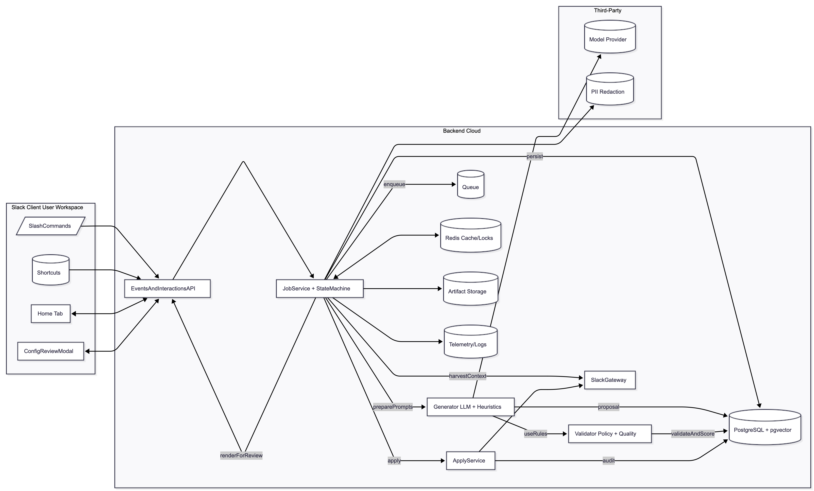
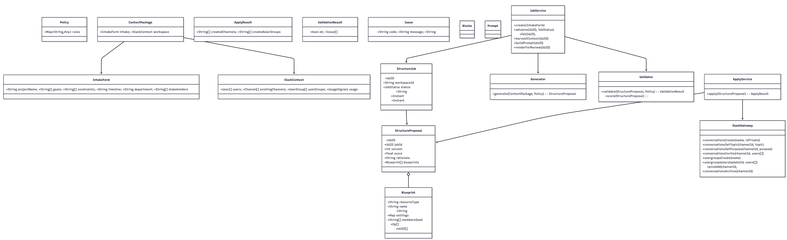
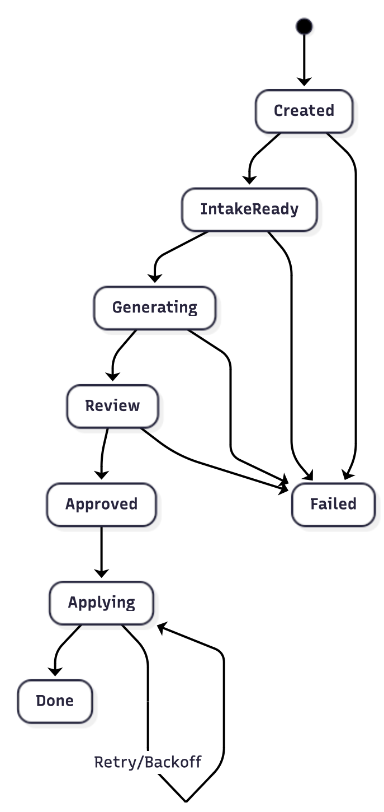
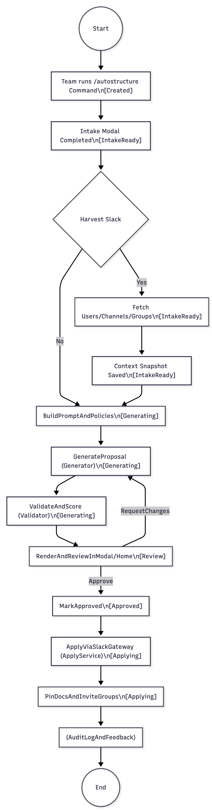
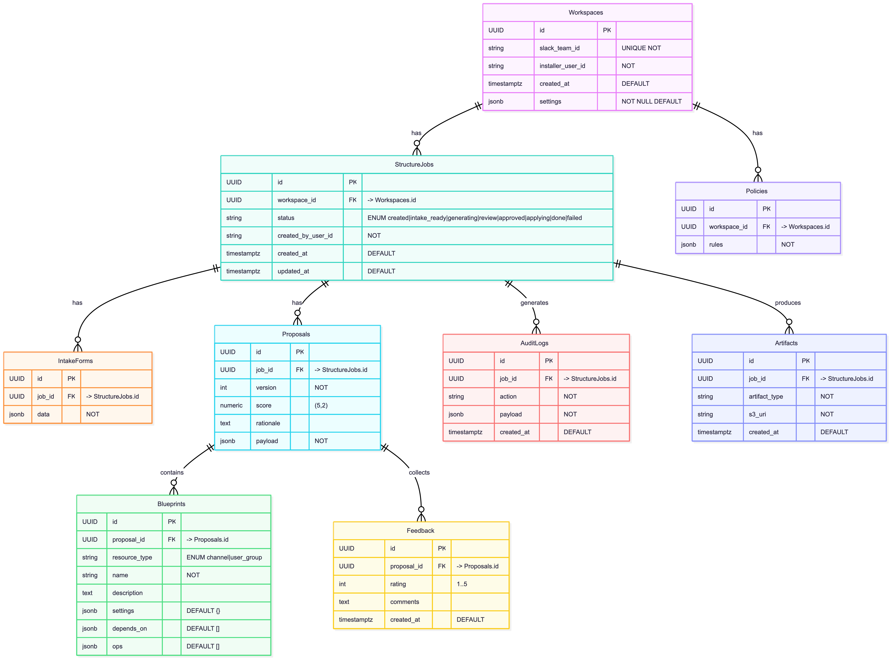

# User Story 1
Version/Date: v4.0 — 2025-10-31
Authors: Akeil Smith, Lexi Kronowitz, Miguel Almeida

## 1. Header
Title: AI-Generated Slack Workspace Structure — Simplified v1 (User Story #1)
User Story:
As a project team, we want Slack to use AI to automatically generate and create an optimized structure for workspaces, channels, and subgroups so that communication is organized, clear, and scalable from the start without requiring manual setup.
Outcome:
A Slack app that proposes and applies a best-practice information architecture (channels, user groups, naming conventions, topics/purposes, and starter workflows) on Day 0, with human-in-the-loop approval.
Primary KPIs:
Time to first usable structure: <10 minutes
Percentage of proposals accepted without edits: >60%
Channel sprawl reduction after 30 days: ≥25%
Team satisfaction (CSAT): ≥4/5

## 2. Architecture Diagram

flowchart LR
  subgraph SlackClient[Slack Client (User Workspace)]
    H[Home Tab]
    M[ConfigReviewModal]
    SC[/SlashCommands/]
    SHT[(Shortcuts)]
  end

  subgraph Backend[Backend (Cloud)]
    API[EventsAndInteractionsAPI]
    JobService[JobService + StateMachine]
    Generator[Generator (LLM + Heuristics)]
    Validator[Validator (Policy + Quality)]
    ApplyService[ApplyService]
    SlackGateway[SlackGateway]
    DB[(PostgreSQL + pgvector)]
    Queue[(Queue)]
    Redis[(Redis Cache/Locks)]
    S3[(Artifact Storage)]
    Observability[(Telemetry/Logs)]
  end

  subgraph ThirdParty[Third-Party]
    LLM[(Model Provider)]
    DLP[(PII Redaction)]
  end

  SC --> API
  SHT --> API
  H <--> API
  M <--> API

  API --> JobService
  JobService -->|persist| DB
  JobService -->|enqueue| Queue
  JobService -->|harvestContext| SlackGateway
  JobService -->|preparePrompts| Generator
  Generator -->|useRules| Validator
  Generator --> LLM
  Generator -->|proposal| DB
  Validator -->|validateAndScore| DB
  JobService -->|renderForReview| API
  JobService -->|apply| ApplyService
  ApplyService --> SlackGateway
  ApplyService -->|audit| DB
  JobService --> S3
  JobService --> Observability
  JobService <--> Redis
  JobService --> DLP

Explanation:
Slack’s user actions (like using a slash command or opening a modal) trigger the EventsAndInteractionsAPI, which starts a job managed by the JobService.
The JobService coordinates all steps—saving progress, gathering workspace data through SlackGateway, and preparing prompts for the Generator, which uses an LLM to suggest a proposed structure.
The Validator checks this proposal against internal policies and quality rules before sending it back to the team for review.
After approval, the ApplyService automatically builds the new channels and groups in Slack.
Data is stored in PostgreSQL, temporary states in Redis, and all events are logged through Observability for auditing.
Optional DLP ensures sensitive data is masked before sending anything to the AI model.
Information Flow:
Trigger → Intake → ContextHarvest → Generation → Validation → Review → Approval → Apply → Audit

## 3. Class Diagram

classDiagram
  class StructureJob {
    +UUID id
    +String workspaceId
    +JobStatus status
    +String createdByUserId
    +Instant createdAt
    +Instant updatedAt
  }

  class StructureProposal {
    +UUID id
    +UUID jobId
    +int version
    +float score
    +String rationale
    +Blueprint[] blueprints
  }

  class Blueprint {
    +String resourceType
    +String name
    +String description
    +Map settings
    +String[] membersSeed
    +Op[] ops
    +UUID[] dependsOn
  }

  class Policy { +Map~String,Any~ rules }
  class ContextPackage { +IntakeForm intake; +SlackContext workspace }
  class IntakeForm { +String projectName; +String[] goals; +String[] constraints; +String timeline; +String department; +String[] stakeholders }
  class SlackContext { +User[] users; +Channel[] existingChannels; +UserGroup[] userGroups; +UsageSignals usage }
  class ApplyResult { +String[] createdChannels; +String[] createdUserGroups }
  class ValidationResult { +bool ok; +Issue[] issues }
  class Issue { +String code; +String message; +String severity }
  class Blocks
  class Prompt

  class JobService {
    +create(IntakeForm)
    +advance(UUID, JobStatus)
    +fail(UUID, String)
    +harvestContext(UUID)
    +buildPrompt(UUID)
    +renderForReview(UUID)
  }

  class Generator { +generate(ContextPackage, Policy): StructureProposal }
  class Validator {
    +validate(StructureProposal, Policy): ValidationResult
    +score(StructureProposal): float
  }
  class ApplyService { +apply(StructureProposal): ApplyResult }
  class SlackGateway {
    +conversationsCreate(name, isPrivate)
    +conversationsSetTopic(channelId, topic)
    +conversationsSetPurpose(channelId, purpose)
    +conversationsInvite(channelId, users[])
    +usergroupsCreate(name)
    +usergroupsUsersUpdate(id, users[])
    +pinsAdd(channelId, item)
    +conversationsArchive(channelId)
  }

  StructureJob --> StructureProposal
  StructureProposal o-- Blueprint
  ContextPackage --> IntakeForm
  ContextPackage --> SlackContext
  JobService --> StructureJob
  JobService --> Generator
  JobService --> Validator
  ApplyService --> StructureProposal
  ApplyService --> SlackGateway

Explanation:
Each class has a focused role.
StructureJob keeps track of the overall process.
StructureProposal stores what the AI suggests, including channels or groups.
Blueprint defines what gets created in Slack and how.
Policy and Validator ensure results follow naming and privacy rules.
ApplyService builds the approved structure in Slack through SlackGateway, which directly calls Slack’s API.
Together, these classes form a clear, modular system that separates decision-making (AI) from execution (Slack integration).

## 4. List of Classes
The following classes define the core entities, logic components, and service interfaces that support automated workspace structure generation. Each class has a specific, clearly scoped purpose within the overall workflow.
StructureJob
Serves as the persistent record for each workflow run. It tracks job status, ownership, and timestamps from creation through completion, enabling full process traceability.
StructureProposal
Contains the versioned AI-generated proposal for workspace structure creation. Includes rationale, quality score, and the list of associated blueprints to be applied.
Blueprint
Defines the declarative instructions for Slack resources such as channels and user groups. Each blueprint specifies configuration details, dependencies, and operations to be executed in sequence.
Policy
Stores all workspace-specific naming, privacy, and retention rules enforced by the Validator. Provides a flexible framework for standardizing configurations across different teams.
ContextPackage
Combines user-provided intake data with harvested workspace metadata, forming a single, contextualized input for the AI generation process.
IntakeForm
Captures key project details supplied by the team, including goals, constraints, timeline, and department context. This ensures the AI output reflects user intent and scope.
SlackContext
Represents a current snapshot of the workspace, including users, existing channels, user groups, and engagement metrics. Enables informed and relevant proposal generation.
ApplyResult
Records the outcomes of the apply phase, listing all newly created Slack entities—such as channels and user groups—along with their identifiers for audit purposes.
ValidationResult / Issue
Summarizes the results of policy enforcement and proposal validation. Each issue entry includes a code, message, and severity to guide revisions and ensure compliance.
JobService
Acts as the orchestrator of the workflow. It manages job lifecycle transitions, builds prompts, and connects all system components from generation to validation and apply.
Generator
Uses the LLM and heuristic logic to create the proposed workspace structure. Focuses on clarity, organization, and adherence to best-practice communication design.
Validator
Enforces workspace policies, detects duplicates or violations, and computes a composite quality score. Supports both automated checks and manual approval workflows.
ApplyService
Executes approved changes safely within Slack. Handles retries, batching, and rollback for reliability and user confidence during deployment.
SlackGateway
Provides a secure, modular interface for interacting with Slack’s API. Abstracts operations such as creating channels, setting topics, and managing user groups.
Blocks
Represents reusable Slack UI elements (Block Kit components) used to build modals, dashboards, and review views within the Slack client interface.
Prompt
Defines the structured instruction templates and contextual parameters sent to the LLM. Every prompt is stored for auditability, reproducibility, and model-tuning analysis.

## 5. State Diagram

stateDiagram-v2
  [*] --> Created
  Created --> IntakeReady
  IntakeReady --> Generating
  Generating --> Review
  Review --> Approved
  Approved --> Applying
  Applying --> Done
  Created --> Failed
  IntakeReady --> Failed
  Generating --> Failed
  Review --> Failed
  Applying --> Applying : Retry/Backoff

Explanation:
Each job moves through predictable stages—from creation to completion—with a human approval step before applying.
If something goes wrong (like missing data or API errors), it transitions to Failed.
Retry mechanisms allow the team to recover from temporary issues (like network errors) without restarting from scratch.

## 6. Flow Chart
Scenario Label: SC1 — Generate and Apply Workspace Structure (User Story #1)

flowchart TD
  Start((Start)) --> A[Team runs "/autostructure" Command\n[Created]]
  A --> B[Intake Modal Completed\n[IntakeReady]]
  B --> C{Harvest Slack Context?}
  C -- Yes --> D[Fetch Users/Channels/Groups\n[IntakeReady]]
  C -- No --> G[BuildPromptAndPolicies\n[Generating]]
  D --> E[Context Snapshot Saved\n[IntakeReady]]
  E --> G
  G --> H[GenerateProposal (Generator)\n[Generating]]
  H --> I[ValidateAndScore (Validator)\n[Generating]]
  I --> J[RenderAndReviewInModal/Home\n[Review]]
  J -- Approve --> JA[MarkApproved\n[Approved]]
  JA --> K[ApplyViaSlackGateway (ApplyService)\n[Applying]]
  J -- RequestChanges --> H
  K --> L[PinDocsAndInviteGroups\n[Applying]]
  L --> M[(AuditLogAndFeedback)]
  M --> Done((End\n[Done]))

Explanation:
This flow shows how a workspace structure is created:
The team starts the process with a slash command.
They fill out a short intake form describing goals and constraints.
The system gathers context from Slack (users, channels).
The AI Generator builds a proposal and the Validator checks it for quality.
The team reviews it in Slack—approving or requesting changes.
Once approved, the structure is applied automatically and logged for future review.

## 7. Development Risks and Mitigations
The team identified several key risks that could impact performance, user trust, or data safety during implementation of the workspace-generation feature. Each risk includes a clear description and corresponding mitigation plan.
Slack API Rate Limits
Too many rapid operations—such as channel creation or user invitations—may trigger throttling by Slack’s API.
Mitigation: Implement queuing, batch invitations, and exponential backoff to safely manage request flow and avoid rate-limit errors.
Insufficient Permissions
Missing or misconfigured API scopes could block critical operations like creating channels or inviting users.
Mitigation: Provide a guided installation process that clearly explains required scopes and ensure graceful fallback behavior when permissions are missing.
Low-Quality Proposals
The AI may occasionally generate redundant, irrelevant, or poorly structured channels.
Mitigation: Enforce strict policy validation, apply schema checks, and include a mandatory human approval step before changes are finalized.
Enterprise Grid Complexity
Multi-workspace Slack environments introduce synchronization and data-sharing challenges.
Mitigation: Limit Version 1 to single-workspace support, then incrementally expand to Enterprise Grid once core stability is proven.
Security or PII Leakage
Prompts or logs could unintentionally include sensitive information such as personal names or email addresses.
Mitigation: Offer an optional Data Loss Prevention (DLP) layer that redacts PII and replaces identifiers with anonymized role labels before processing.
Change Management
Users may be surprised or confused by automated workspace creation and configuration.
Mitigation: Provide clear previews of proposed changes, post transparent announcements, and include rollback or archival options to maintain user confidence.

## 8. Technology Stack
Language/Runtime: TypeScript (Node.js 20)
Frameworks: Bolt for Slack (Events & Interactivity), Fastify (REST API)
Infrastructure: AWS Lambda + API Gateway (or Cloud Run), SQS, CloudWatch/X-Ray or OpenTelemetry for end-to-end observability
Data: PostgreSQL + pgvector, Redis, S3
AI: GPT-5 LLM with JSON schema validation (structured, deterministic outputs for safe backend integration)
CI/CD: GitHub Actions, Terraform (Infrastructure as Code)
Testing: Jest (unit), Pact (contract), Playwright (UI flows), k6 (load & apply-phase)

## 9. APIs
Incoming Slack APIs
POST /slack/events — Receives event data and app mentions.
POST /slack/interactions — Handles modals, buttons, and block actions.
Internal REST APIs
POST /jobs — Creates a StructureJob.
GET /jobs/{id} — Returns job status and proposal data.
POST /jobs/{id}/harvest — Gathers Slack context.
POST /jobs/{id}/generate — Runs Generator to create a proposal.
POST /jobs/{id}/validate — Validates and scores proposals.
POST /proposals/{id}/approve — Marks as approved.
POST /proposals/{id}/apply — Executes ApplyService.
POST /proposals/{id}/feedback — Stores user feedback.

## 10. Public Interfaces
This feature provides several user-facing interaction points within Slack, each designed to guide the team smoothly through the workspace structure generation process — from initial setup to review and confirmation.
Slash Command — /autostructure
Initiates the intake and creation process. When the command is run, it launches the intake workflow where users can provide project details to begin generating a workspace structure.
Shortcut — “Generate Structure from Thread”
Allows users to trigger structure generation directly from an existing Slack conversation. It automatically seeds the IntakeForm with relevant context, saving time and maintaining discussion continuity.
Home Tab
Serves as the central dashboard within Slack. It displays current jobs, past generations, and quick-access actions for creating new structures or managing existing ones.
Intake Modal
Collects essential setup information from the user, including project goals, constraints, timelines, and key participants. This ensures the AI proposal aligns with the team’s requirements.
Proposal Review Modal
Presents the AI-generated structure for user review. The team can make edits, approve, or request changes before the structure is finalized, ensuring transparency and control.
Confirmation Modal
Provides a final summary of proposed changes, including expected channel and group creations. Users can confirm or cancel before any updates are applied to the workspace.

## 11. Data Schemas (SQL DDL)

erDiagram
    Workspaces ||--o{ StructureJobs : has
    StructureJobs ||--o{ IntakeForms : has
    StructureJobs ||--o{ Proposals : has
    Proposals ||--o{ Blueprints : contains
    Workspaces ||--o{ Policies : has
    StructureJobs ||--o{ AuditLogs : generates
    Proposals ||--o{ Feedback : collects
    StructureJobs ||--o{ Artifacts : produces

    Workspaces {
      UUID id PK
      string slack_team_id "UNIQUE NOT NULL"
      string installer_user_id "NOT NULL"
      timestamptz created_at "DEFAULT now()"
      jsonb settings "NOT NULL DEFAULT {}"
    }

    StructureJobs {
      UUID id PK
      UUID workspace_id FK "-> Workspaces.id"
      string status "ENUM created|intake_ready|generating|review|approved|applying|done|failed"
      string created_by_user_id "NOT NULL"
      timestamptz created_at "DEFAULT now()"
      timestamptz updated_at "DEFAULT now()"
    }

    IntakeForms {
      UUID id PK
      UUID job_id FK "-> StructureJobs.id"
      jsonb data "NOT NULL"
    }

    Proposals {
      UUID id PK
      UUID job_id FK "-> StructureJ_

## 12. Security and Privacy
Least Privilege Scopes: Only essential Slack permissions are requested.
Data Minimization: Avoid storing sensitive user info; use role placeholders.
Encryption: TLS for data in transit; AES-256 at rest with AWS KMS.
Access Control: Role-based access and immutable audit logs.
Retention: Default 30-day log retention, configurable per workspace.
Optional DLP: Redacts personal data in prompts before AI calls.
Guardrails: Validator blocks disallowed names and risky channel patterns.

## 13. Risks to Completion

This feature carries several potential risks that could affect delivery timelines, user adoption, and performance. Each risk is paired with a clearly defined probability, project impact level, and mitigation plan.
App Review & Distribution — Medium probability / Medium impact.
Slack’s review process could delay public release. The team will prepare documentation, scope rationale, and screenshots early, and conduct a private beta before general availability.
Model Cost and Latency — Medium probability / High impact.
Generating structural proposals with the model may be slow or expensive. To mitigate, prompts will be cached, smaller draft models used, and results streamed progressively to users.
Customer Policy Variance — High probability / Medium impact.
Workspaces differ in naming and privacy rules. Policies will be data-driven and configurable, with editable templates exposed in the admin settings.
Testing Realism — Medium probability / Medium impact.
Limited real data before launch could hinder testing accuracy. The team will build synthetic workspaces and a golden dataset to benchmark generation quality.
Adoption Risk — High probability / High impact.
Some teams may hesitate to allow automated creation of channels or groups. To address this, the product will emphasize preview diffs, rollback capabilities, and clear onboarding.

## LLM (GPT 5) Chatlogs:
https://chatgpt.com/share/68f80cb0-22d0-800a-8b7b-64b253da48b9 
https://chatgpt.com/share/6904f85f-a00c-800d-8a56-13c59fdac253 
https://chatgpt.com/share/6904f85f-a00c-800d-8a56-13c59fdac253  