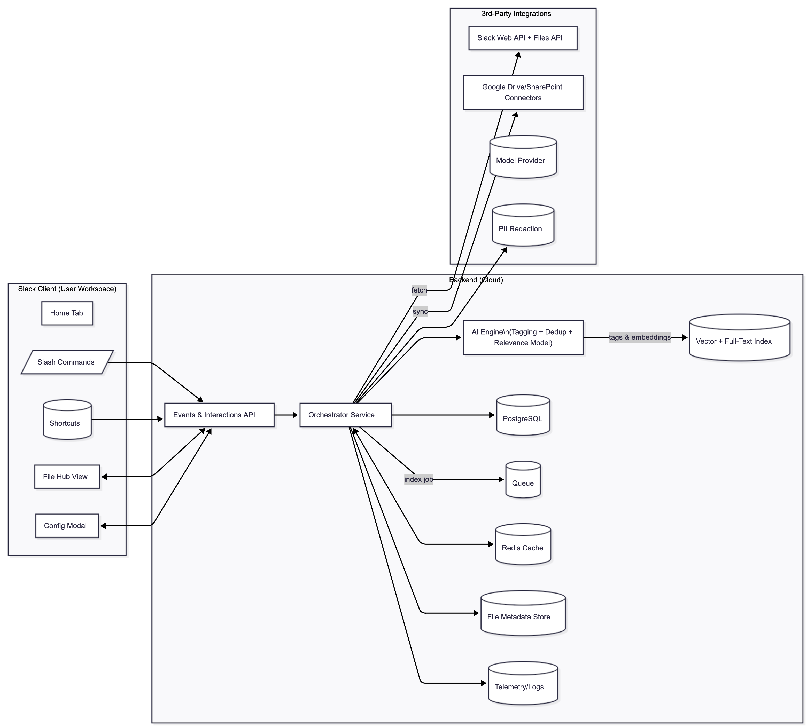
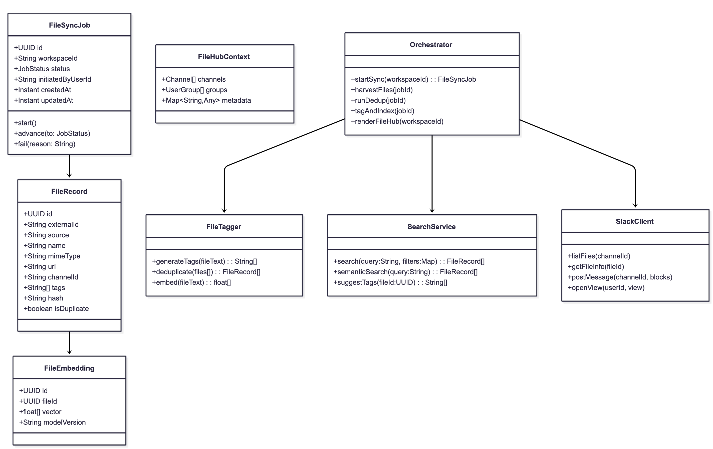
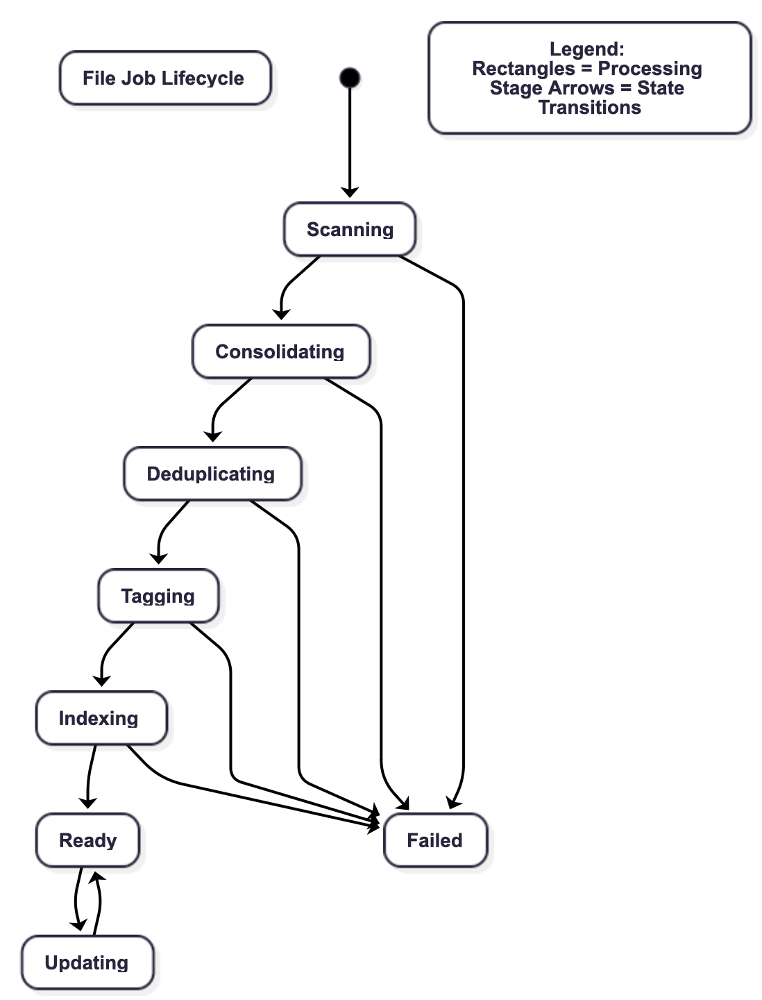
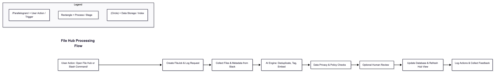
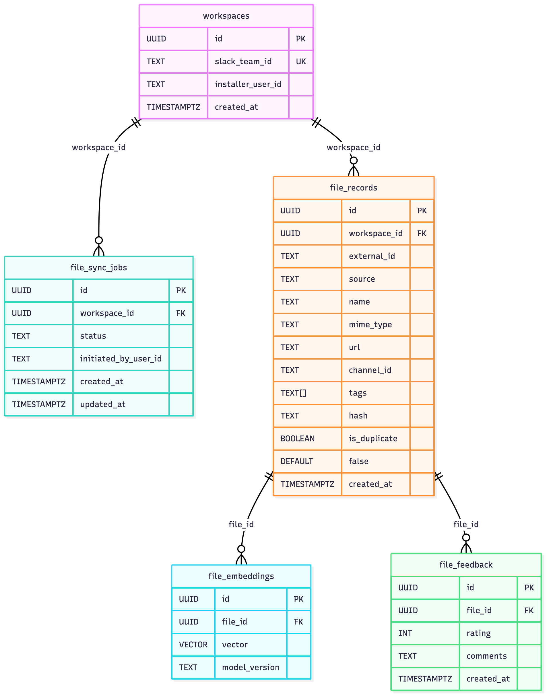

# User Story 2

## 1. Header
Title: AI-Driven Centralized File Hub (User Story #2)
Authors: Akeil Smith, Lexi Kronowitz, Miguel Almeida
Version/Date: v1.1 — 2025-10-22
User Story:
As a project manager, I want Slack to design a centralized project file hub that integrates with the workspace structure, using channel and subgroup data to consolidate, deduplicate, tag, and make all project files searchable so that my team can easily find and manage files across the workspace.
Outcome:
A unified file management layer that automatically organizes, indexes, and tags project-related documents across Slack channels and groups, using AI to deduplicate and surface the most relevant versions, with in-Slack search and filtering.
Primary KPIs:
File retrieval time ≤5s, duplicate file rate <10%, search precision@5 ≥0.8, PM satisfaction (CSAT ≥4/5).

## 2. Architecture Diagram

flowchart LR
  title["Centralized File Hub Architecture"]
  title:::titleStyle

  subgraph Slack_Client["Slack Client (User Workspace)"]
    H[Home Tab]
    FH[File Hub View]
    SC[/Slash Commands/]
    SHT[(Shortcuts)]
  end

  subgraph Backend["Backend (Cloud Infrastructure)"]
    API[Events & Interactions API]
    ORC[Orchestrator Service]
    AI["AI Engine\n(Deduplication + Tagging + Search Indexing)"]
    SLI[Slack Integration Layer]
    DB[(PostgreSQL + pgvector)]
    Q[(Queue System)]
    REDIS[(Redis Cache)]
    S3[(File Metadata Storage)]
    OBS[(Telemetry/Logs)]
    IDX[(Vector Index)]
  end

  subgraph Third_Party["Third-Party Services"]
    LLM[(Model Provider)]
    DLP[(Data Loss Prevention Service)]
    SEARCH[(External Search API)]
  end

  SC --> API
  SHT --> API
  H <--> API
  FH <--> API

  API --> ORC
  ORC -->|Collects Metadata| SLI
  ORC --> AI
  ORC -->|Stores Results| DB
  AI -->|Embeddings| IDX
  AI --> LLM
  ORC --> S3
  ORC --> OBS
  ORC <--> REDIS
  ORC --> DLP
  ORC --> SEARCH

  subgraph Legend["Legend"]
    L1[Square = Process or Service]
    L2[(Circle) = Data Store or Cache]
    L3[/Parallelogram/ = User Command or Action]
    L4[(Rounded Box) = Integration / API Layer]
  end

  classDef titleStyle fill=none,stroke=none,font-size:20px,font-weight:bold;

Explanation:
This diagram represents the system architecture, showing how Slack clients, backend services, and third-party integrations work together. Users interact via Home Tab, File Hub, shortcuts, or slash commands, which are captured by the Events & Interactions API. The Orchestrator coordinates the workflow, collecting file metadata through the Slack Integration Layer, and invoking the AI Engine for deduplication, tagging, and embedding for semantic search. The PostgreSQL database with pgvector stores metadata and indexes, while Redis caches frequently accessed data. Files and artifacts persist in S3, and telemetry is captured in OBS. Third-party services include an LLM for semantic understanding, a DLP service for privacy, and optional external search APIs. The legend clarifies diagram symbols for non-technical stakeholders.

## 3. Class Diagram

classDiagram
  classTitle["Core File Hub Classes"]
  classTitle:::titleStyle

  class FileJob {
    +UUID id
    +String workspaceId
    +JobStatus status
    +Instant createdAt
    +Instant updatedAt
    +start()
    +advance(to: JobStatus)
    +fail(reason: String)
  }

  class FileRecord {
    +UUID id
    +String slackFileId
    +String channelId
    +String uploaderUserId
    +String name
    +String mimeType
    +String hash
    +Instant uploadedAt
    +Map~String,Any~ tags
  }

  class FileIndex {
    +UUID id
    +UUID jobId
    +Embedding vector
    +String[] keywords
    +float relevance
    +update(vector,metadata)
  }

  class DeduplicationEngine {
    +findDuplicates(files: FileRecord[]): FileRecord[][]
    +mergeMetadata(duplicates: FileRecord[]): FileRecord
  }

  class TaggingEngine {
    +generateTags(file: FileRecord): Map~String,Any~
    +normalize(tags): Map~String,Any~
  }

  class SearchService {
    +search(query: String): FileRecord[]
    +rank(results): FileRecord[]
    +filterBy(tags: Map~String,String~)
  }

  class Orchestrator {
    +createJob()
    +harvestFiles()
    +invokeAI()
    +updateIndex()
    +search(query)
    +recordAudit(action, payload)
  }

  class SlackClient {
    +listFiles(channelId)
    +getFileInfo(fileId)
    +openFileHub(userId)
    +previewFile(fileId)
  }

  FileJob --> FileRecord
  FileJob --> FileIndex
  FileRecord --> FileIndex
  Orchestrator --> SlackClient
  Orchestrator --> DeduplicationEngine
  Orchestrator --> TaggingEngine
  Orchestrator --> SearchService

  class Legend {
    Note1["Solid Arrow = Data Flow / Invocation"]
    Note2["Class = Core Functional Component"]
    Note3["+Method() = Public Function / Service Operation"]
  }

  classDef titleStyle fill=none,stroke=none,font-size:20px,font-weight:bold;

Explanation:
This class diagram displays the key backend classes and their relationships. FileJob represents a processing workflow for a set of files, storing metadata about status, timestamps, and error handling. FileRecord represents individual Slack files, and FileIndex stores embeddings for semantic search. DeduplicationEngine identifies duplicates, while TaggingEnginegenerates context-based tags. SearchService allows querying files by keywords and tags. The Orchestrator manages the entire workflow and interacts with the SlackClient to retrieve files and trigger updates. The legend clarifies class symbols and arrow meanings for easy understanding.

## 4. State Diagram

stateDiagram-v2
   title: File Job Lifecycle

   [*] --> Scanning
   Scanning --> Consolidating
   Consolidating --> Deduplicating
   Deduplicating --> Tagging
   Tagging --> Indexing
   Indexing --> Ready
   Ready --> Updating
   Updating --> Ready
   Scanning --> Failed
   Consolidating --> Failed
   Deduplicating --> Failed
   Tagging --> Failed
   Indexing --> Failed

   state "Legend:
   Rectangles = Processing
   Stage Arrows = State Transitions"  as Legend
  

   classDef titleStyle fill=none,stroke=none,font-size:20px,font-weight:bold

Explanation:
This state diagram illustrates the lifecycle of a file processing job. Jobs begin in Scanning, collecting files from Slack. They progress through Consolidating, where file metadata is unified, then Deduplicating, which removes duplicates. Tagging applies semantic labels, and Indexing generates the vector search index. Once ready, jobs enter Updating for new or modified files. Any stage can transition to Failed, allowing retries and audit logging. The legend clarifies stage symbols and transitions for non-technical stakeholders.

## 5. Flow Chart

flowchart LR
  title["File Hub Processing Flow"]
  title:::titleStyle

  Trigger[/User Action: Open File Hub or Slash Command/]
  Intake[Create FileJob & Log Request]
  Harvest[Collect Files & Metadata from Slack]
  Synthesis[AI Engine: Deduplicate, Tag, Embed]
  Guardrails[Data Privacy & Policy Checks]
  Review[Optional Human Review]
  Apply[Update Database & Refresh Hub View]
  Audit[Log Actions & Collect Feedback]

  Trigger --> Intake --> Harvest --> Synthesis --> Guardrails --> Review --> Apply --> Audit

  subgraph Legend["Legend"]
    L1[/Parallelogram/ = User Action / Trigger]
    L2[Rectangle = Process / Stage]
    L3[(Circle) = Data Storage / Index]
  end

  classDef titleStyle fill=none,stroke=none,font-size:20px,font-weight:bold;

Explanation:
The flowchart visualizes the end-to-end process of a file job. Users trigger the workflow via Slack, and the Orchestrator creates a FileJob. Files and metadata are collected from Slack channels and groups. The AI Engine deduplicates files, generates tags, and creates vector embeddings. Guardrails ensure data privacy and policy compliance. Optionally, human reviewers validate critical actions. The Apply stage updates the database and refreshes the File Hub, and Audit logs capture actions and feedback. The legend explains the meaning of diagram symbols, making it understandable for non-technical readers.

## 6. Technology Stack
Backend: Node.js 20, TypeScript, Fastify
Slack Integration: Bolt for Slack
Database: PostgreSQL + pgvector
Caching & Queue: Redis, SQS
File Storage: AWS S3
Observability: OpenTelemetry
Testing: Jest, Playwright, Pact
Infrastructure: Terraform
AI Models: LLM provider (GPT-4-class)

## 7. APIs
Incoming Slack Events:
POST /slack/events — app_mentions, shortcuts, etc.
POST /slack/interactions — modal submissions, buttons
Internal REST:
POST /files/jobs — creates a FileJob
GET /files/jobs/{id} — retrieves job status and progress
POST /files/jobs/{id}/review — mark job as reviewed
POST /files/jobs/{id}/feedback — submit user feedback

## 8. Public Interfaces
Orchestrator Methods: createJob(), harvestFiles(), invokeAI(), updateIndex(), recordAudit()
Evaluator Methods: detectDuplicates(), validateTags(), scoreRelevance()
SlackClient Methods: listFiles(), getFileInfo(), openFileHub(), previewFile()

## 9. Development Risks and Failures
Potential issues include Slack API rate limits, AI misclassification, search latency, storage overhead, and tag inconsistency. Mitigation strategies involve caching, deduplication via multiple metrics, index optimization, embedding pruning, and versioned prompts for AI tagging. Continuous monitoring and alerting are implemented to detect and respond to failures quickly.

## 10. Data Schemas

erDiagram
    workspaces {
        UUID id PK
        TEXT slack_team_id UK
        TIMESTAMPTZ created_at "DEFAULT now()"
    }

    file_jobs {
        UUID id PK
        UUID workspace_id FK
        TEXT status
        TIMESTAMPTZ created_at
        TIMESTAMPTZ updated_at
    }

    files {
        UUID id PK
        UUID workspace_id FK
        TEXT slack_file_id UK
        TEXT name
        TEXT channel_id
        TEXT uploader_user_id
        TEXT mime_type
        TEXT hash
        JSONB tags "DEFAULT '{}' NOT NULL"
        TIMESTAMPTZ uploaded_at
    }

    file_index {
        UUID id PK
        UUID file_id FK
        VECTOR embedding
        JSONB keywords "DEFAULT '[]' NOT NULL"
        NUMERIC relevance "(3,2)"
    }

    audit_logs {
        UUID id PK
        UUID job_id FK
        TEXT action
        JSONB payload
        TIMESTAMPTZ created_at
    }

    feedback {
        UUID id PK
        UUID file_id FK
        INT rating
        TEXT comments
        TIMESTAMPTZ created_at
    }

    workspaces ||--o{ file_jobs : "workspace_id"
    workspaces ||--o{ files : "workspace_id"
    files ||--o{ file_index : "file_id"
    file_jobs ||--o{ audit_logs : "job_id"
    files ||--o{ feedback : "file_id"

Explanation:
Workspaces contain multiple file jobs and files. Files are indexed for semantic search via embeddings. Audit logs capture all job actions. Feedback is linked to files to improve AI accuracy. Relationships maintain data integrity and enable efficient query operations.

## 11. Security and Privacy (Expanded)
The AI-Driven Centralized File Hub handles sensitive project documents, which means security and privacy are top priorities. The system follows a least-privilege approach, requesting only the Slack OAuth scopes strictly necessary to operate (e.g., channels:read, groups:read, files:read, usergroups:read). This ensures that if a token is compromised, the potential damage is minimized.
Data minimization is employed by storing only Slack IDs, metadata, and file embeddings rather than full personal content. When the AI engine requires examples for tagging or deduplication, PII such as usernames or email addresses is replaced with role-based labels. This reduces exposure of personal information and helps maintain compliance with privacy regulations.
All communication is encrypted with TLS during transit, and data at rest is encrypted using AES-256 managed via AWS KMS. Secrets, such as Slack tokens and AI keys, are stored in a secure secrets manager and never embedded in code or environment files.
Access control is managed on a per-workspace basis, and only authorized operators with role-based permissions can perform administrative actions. All apply operations and sensitive actions are audited to provide a complete record of who did what and when.
The system also provides retention and deletion policies, with proposals and audit logs retained for a default of 30 days, configurable by workspace administrators. A pluggable DLP redaction step masks emails and names before sending content to AI models hosted outside the workspace region. Additionally, the policy engine blocks creation of channels containing restricted keywords unless overridden by an admin, helping enforce compliance and prevent accidental leaks.

## 12. Risks to Completion (Expanded)
Several factors could impact the timely completion and deployment of the File Hub. Slack App approval can introduce delays because the platform reviews OAuth scopes and app distribution. To mitigate this, detailed documentation, security notes, and sample screens should be prepared early, and a private beta can be used to test functionality while waiting for approval.
AI model performance introduces risk: generating deduplicated, tagged, and searchable file metadata can be slow or produce inconsistent results. This is mitigated by caching prompts, using smaller models for draft processing, and streaming partial results to ensure users are not blocked.
Heterogeneous workspace policies are another challenge. Different organizations have varied naming conventions, privacy requirements, and access controls. This is addressed through the policy engine, which allows workspace-specific rules and templates while ensuring consistent validation.
Data scarcity for testing may delay accurate AI performance evaluation. To counter this, synthetic workspaces and curated “golden sets” are used for regression testing, enabling thorough pre-production validation.
Finally, user resistance could impact adoption if teams are wary of automatic file organization. Preview diffs, rollback capabilities, and clear onboarding guidance help reduce confusion and encourage trust in the system.

## 13. Development Risks and Failures (Expanded)
The development process itself presents risks that need to be anticipated. Processing bottlenecks can occur when multiple jobs attempt to read large numbers of files or compute embeddings simultaneously. This is mitigated with queuing mechanisms, rate limiting, and caching intermediate results.
Duplicate detection errors could lead to false merges or missed duplicates. The system uses multi-factor comparison, including file hash, size, and vector similarity, to reduce these errors. AI misclassification or inconsistent tagging may occur if the AI model evolves; versioned prompts and periodic human review help maintain accuracy.
Storage growth and search latency are also concerns because embedding vectors can be large, and the index may grow over time. Periodic pruning, approximate nearest-neighbor search techniques, and Redis caching help maintain performance.
Third-party dependencies, such as external LLM providers or Slack API updates, introduce potential failures. These are mitigated with retries, exponential backoff, and monitoring alerts to quickly detect and respond to failures.
Overall, a combination of proactive monitoring, fallback handling, and robust operational policies ensures that the system remains reliable, secure, and responsive even under high load or unexpected errors.

LLM (GPT 4 and 5) Chatlog: https://chatgpt.com/share/68f969e6-fe74-800d-9ca0-329833bca32c 
