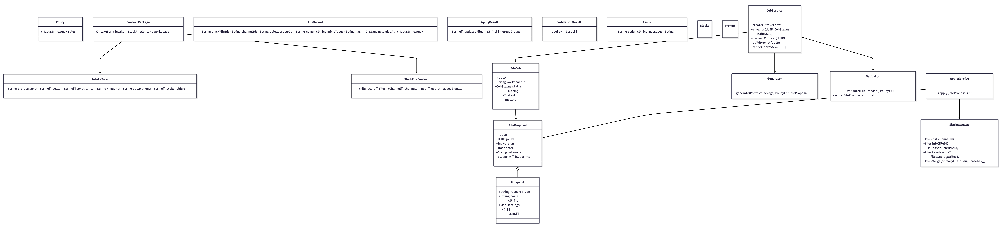

# User Story 2
Version/Date: v4.0 — 2025-10-31
Authors: Akeil Smith, Lexi Kronowitz, Miguel Almeida

## 1. Header
Title: AI-Driven Centralized File Hub — Simplified v1 (User Story #2)

User Story:
As a project team, we want Slack to design a centralized project file hub that integrates with the workspace structure, using channel and subgroup data to consolidate, deduplicate, tag, and make all project files searchable so that the team can easily find and manage files across the workspace.

Outcome:
A unified file-management layer that automatically organizes, indexes, and tags project-related documents across Slack channels and groups, using AI to deduplicate and surface the most relevant versions with in-Slack search and filtering. Bulk actions are always confirmed by the team before execution.

Primary KPIs:
File retrieval time ≤ 5 s
Duplicate file rate < 10 %
Search precision@5 ≥ 0.8
Team satisfaction (CSAT ≥ 4 / 5)

## 2. Architecture Diagram

flowchart LR
  subgraph SlackClient[Slack Client (User Workspace)]
    H[HomeTab]
    M[ConfigReviewModal]
    SC[/SlashCommands/]
    SHT[(Shortcuts)]
  end

  subgraph Backend[Backend (Cloud)]
    API[EventsAndInteractionsAPI]
    JobService[JobService + StateMachine]
    Generator[Generator (LLM + Heuristics)]
    Validator[Validator (Policy + Quality)]
    ApplyService[ApplyService]
    SlackGateway[SlackGateway]
    DB[(PostgreSQL + pgvector)]
    Queue[(Queue)]
    Redis[(Redis Cache/Locks)]
    S3[(Artifact Storage)]
    Observability[(Telemetry/Logs)]
  end

  subgraph ThirdParty[Third-Party]
    LLM[(Model Provider)]
    DLP[(PII Redaction)]
  end

  SC --> API
  SHT --> API
  H <--> API
  M <--> API

  API --> JobService
  JobService -->|persist| DB
  JobService -->|enqueue| Queue
  JobService -->|harvestContext| SlackGateway
  JobService -->|preparePrompts| Generator
  Generator -->|useRules| Validator
  Generator --> LLM
  Generator -->|proposal| DB
  Validator -->|validateAndScore| DB
  JobService -->|renderForReview| API
  JobService -->|apply| ApplyService
  ApplyService --> SlackGateway
  ApplyService -->|audit| DB
  JobService --> S3
  JobService --> Observability
  JobService <--> Redis
  JobService --> DLP

Explanation:
When the team runs a file-hub action in Slack (using a command or shortcut), Slack’s Events and Interactions API triggers a new workflow through the JobService.
The JobService acts like a coordinator — it collects metadata about files and channels through the SlackGateway, builds prompts for the Generator, and passes them to the LLM to create a structured FileProposal.
The Validator checks that proposal against policy rules and quality criteria before sending it back to the team for review.
After approval, the ApplyService executes approved actions (merging duplicates, retagging, reindexing).
All operations are logged in DB and Observability, with temporary data stored in Redis and artifacts like diffs kept in S3.
DLP filters protect sensitive information before it reaches the AI model.
Information Flow: Trigger → Intake → ContextHarvest → Generation → Validation → Review → Approval → Apply → Audit

## 3. Class Diagram

classDiagram
  class FileJob {
    +UUID id
    +String workspaceId
    +JobStatus status
    +String createdByUserId
    +Instant createdAt
    +Instant updatedAt
  }

  class FileProposal {
    +UUID id
    +UUID jobId
    +int version
    +float score
    +String rationale
    +Blueprint[] blueprints
  }

  class Blueprint {
    +String resourceType
    +String name
    +String description
    +Map settings
    +Op[] ops
    +UUID[] dependsOn
  }

  class Policy { +Map~String,Any~ rules }
  class ContextPackage { +IntakeForm intake; +SlackFileContext workspace }
  class IntakeForm { +String projectName; +String[] goals; +String[] constraints; +String timeline; +String department; +String[] stakeholders }
  class SlackFileContext { +FileRecord[] files; +Channel[] channels; +User[] users; +UsageSignals usage }
  class FileRecord { +String slackFileId; +String channelId; +String uploaderUserId; +String name; +String mimeType; +String hash; +Instant uploadedAt; +Map~String,Any~ tags }
  class ApplyResult { +String[] updatedFiles; +String[] mergedGroups }
  class ValidationResult { +bool ok; +Issue[] issues }
  class Issue { +String code; +String message; +String severity }
  class Blocks
  class Prompt

  class JobService {
    +create(IntakeForm)
    +advance(UUID, JobStatus)
    +fail(UUID, String)
    +harvestContext(UUID)
    +buildPrompt(UUID)
    +renderForReview(UUID)
  }

  class Generator { +generate(ContextPackage, Policy): FileProposal }
  class Validator {
    +validate(FileProposal, Policy): ValidationResult
    +score(FileProposal): float
  }
  class ApplyService { +apply(FileProposal): ApplyResult }
  class SlackGateway {
    +filesList(channelId)
    +filesInfo(fileId)
    +filesSetTitle(fileId, title)
    +filesReindex(fileId)
    +filesSetTags(fileId, tags[])
    +filesMerge(primaryFileId, duplicateIds[])
  }

  FileJob --> FileProposal
  FileProposal o-- Blueprint
  ContextPackage --> IntakeForm
  ContextPackage --> SlackFileContext
  JobService --> FileJob
  JobService --> Generator
  JobService --> Validator
  ApplyService --> FileProposal
  ApplyService --> SlackGateway

Explanation:
Each class represents a piece of the file-hub workflow:
FileJob tracks job status and ownership.
FileProposal stores the AI-generated plan for file actions.
Blueprint lists specific operations (merge, reindex, retag).
Policy contains workspace rules.
Validator checks for policy compliance and risk.
ApplyService executes actions through SlackGateway, which connects to Slack’s API.

## 4. List of Classes
The following classes define the main data entities, logical components, and supporting services that power the File Hub system. Each plays a distinct role in managing file-related automation, validation, and user review within Slack.

FileJob
Acts as the persistent record of every File Hub run. It tracks state, ownership, and timestamps throughout execution, ensuring full lifecycle visibility and auditability.

FileProposal
Contains the AI-generated set of recommended file actions, including deduplication, tagging, and reindexing operations. Each proposal includes rationale, a version number, and a quality score for traceable evaluation.

Blueprint
Defines the declarative, idempotent instructions for file operations and their execution dependencies. Supports clear ordering of actions such as tag updates, duplicate merges, and index refreshes.

Policy
Serves as a data-only container that stores workspace rules for retention, tagging standards, and scope validation. Consumed by the Validator to enforce organizational governance.

ContextPackage
Bundles together user-provided intake data and harvested workspace metadata into a unified structure used during proposal generation.

IntakeForm
Collects team-supplied details such as project goals, timeline, and specific constraints. This input defines the intent of the run and ensures contextual relevance for AI-driven decisions.

SlackFileContext
Represents a live snapshot of files, channels, and users within the workspace, along with associated usage metrics. Enables the Generator to identify redundancies and suggest optimized file groupings.

FileRecord
Stores detailed metadata for each file, including uploader, hash, MIME type, and applied tags. This class enables accurate deduplication, traceability, and compliance tracking.

ApplyResult
Captures all outputs from the apply phase, including lists of updated, merged, or re-tagged files. Provides a clear record of completed actions for user confirmation.

ValidationResult / Issue
Documents validation outcomes and detected issues. Each entry specifies a code, message, and severity to help teams understand compliance gaps and quality scores.

JobService
Coordinates the entire workflow lifecycle—from job creation to completion. Manages state transitions, prompt generation, and rendering of Slack review components.

Generator
Uses the LLM and supporting heuristics to produce high-quality FileProposals. Focuses on balancing efficiency, accuracy, and adherence to workspace policies.

Validator
Applies defined rules to evaluate each proposed action for safety and quality. Scores proposals, flags risky operations, and ensures compliance with tagging and retention policies.

ApplyService
Executes approved file operations through Slack’s API. Incorporates retry logic, batching, and error handling to maintain reliability and avoid exceeding rate limits.

SlackGateway
Provides a structured interface to Slack’s file management endpoints. Handles listing, tagging, merging, and metadata updates while isolating API logic from core services.

Blocks
Represents reusable Slack Block Kit UI components used in Home Tab and review modals. Supports consistent and interactive presentation of job data to users.

Prompt
Stores the structured instructions, contextual parameters, and policies sent to the LLM. Each prompt is archived for auditability, reproducibility, and future model-tuning analysis.

## 5. State Diagram

stateDiagram-v2
  [*] --> Created
  Created --> IntakeReady
  IntakeReady --> Generating
  Generating --> Review
  Review --> Approved
  Approved --> Applying
  Applying --> Done
  Created --> Failed
  IntakeReady --> Failed
  Generating --> Failed
  Review --> Failed
  Applying --> Applying : Retry/Backoff

Explanation:
Jobs progress through defined phases. Each step represents a key moment in the file hub process—from intake to approval to application. If an error occurs, the system moves to Failed, but temporary failures can retry safely without losing progress.

## 6. Flow Chart

Scenario Label: SC2 — Generate and Apply File Hub Actions (User Story #2)
flowchart TD
  Start((Start)) --> A[Team runs "/filehub" Command\n[Created]]
  A --> B[IntakeModal Completed\n[IntakeReady]]
  B --> C{HarvestFileContext?}
  C -- Yes --> D[List Files and Metadata Across Channels\n[IntakeReady]]
  C -- No --> G[BuildPromptAndPolicies\n[Generating]]
  D --> E[ContextSnapshotSaved\n[IntakeReady]]
  E --> G
  G --> H[GenerateFileProposal (Generator)\n[Generating]]
  H --> I[ValidateAndScore (Validator)\n[Generating]]
  I --> J[RenderAndReviewInModal/Home\n[Review]]
  J -- Approve --> JA[MarkApproved\n[Approved]]
  JA --> K[ApplyViaSlackGateway (ApplyService)\n[Applying]]
  J -- RequestChanges --> H
  K --> L[ExecuteFileOps (updateTags, mergeDuplicates, reindex)\n[Applying]]
  L --> M[(AuditLogAndFeedback)]
  M --> Done((End\n[Done]))

Explanation:
The team starts the process with the /filehub command.
They complete an intake form to define scope and constraints.
The system collects file metadata from Slack.
The AI Generator proposes actions to clean and organize files.
The Validator checks for compliance and risk.
The team reviews the proposal in Slack and either approves or requests changes.
After approval, the ApplyService runs safe file operations and records results in the audit log.

## 7. Development Risks and Failures
The File Hub feature introduces risks related to app approval, performance, data governance, and user adoption. Each identified risk includes its probability, project impact, and mitigation strategy to ensure stability, trust, and compliance.

App Review Delays — Medium probability / Medium impact.
The Slack app review process may slow the public release timeline.
Mitigation: Submit scope documentation, permission rationale, and screenshots early, and launch a private beta before full deployment.

Model Cost and Latency — Medium probability / High impact.
LLM inference may increase system latency or operational costs.
Mitigation: Cache common prompts, use smaller draft models for preliminary runs, and progressively load results in the user interface.

Policy Variance — High probability / Medium impact.
Each workspace may follow unique retention and tagging conventions.
Mitigation: Design policies to be data-driven and fully editable per workspace, allowing customization without code changes.

Testing Realism — Medium probability / Medium impact.
Limited access to real data could reduce the accuracy of validation and quality assurance.
Mitigation: Generate synthetic datasets and maintain golden test sets to benchmark model performance consistently.

Adoption Risk — High probability / High impact.
Teams may be hesitant to approve automated or bulk file modifications.
Mitigation: Offer clear dry-run previews, visible rollback options, and transparent UX messaging to build user confidence.

Slack API Rate Limits — Medium probability / Medium impact.
Performing high-volume file updates could trigger Slack API rate throttling.
Mitigation: Queue and batch operations, use exponential backoff, and pre-estimate API calls to stay within rate limits.

Insufficient Permissions — Low probability / High impact.
Missing Slack scopes could prevent file tagging, merging, or retrieval.
Mitigation: Use a guided installation process with explicit scope explanations and implement graceful fallback behaviors for unsupported operations.

Low-Quality Proposals — Medium probability / Medium impact.
The AI may misclassify duplicate files or suggest incorrect tagging actions.
Mitigation: Enforce strict policy validation, require manual approval checkpoints, and refine prompt tuning with representative examples.

Security / PII Leakage — Low probability / High impact.
Prompts or logs may contain sensitive personal or organizational data.
Mitigation: Apply optional DLP masking, anonymize identifiers, and use encrypted storage for all audit artifacts.

Change Management — Medium probability / Medium impact.
Users might be caught off guard by automated file or tag updates.
Mitigation: Provide detailed preview modals, confirmation steps before execution, and undo options to maintain transparency and control.

## 8. Technology Stack
Language/Runtime: TypeScript (Node.js 20)

Frameworks: Bolt for Slack (Events & Interactivity), Fastify (REST API)

Infrastructure: AWS Lambda + API Gateway (or Cloud Run), SQS, CloudWatch/X-Ray or OpenTelemetry for end-to-end observability

Data: PostgreSQL + pgvector, Redis, S3

AI: GPT-5 LLM with JSON schema validation (structured, deterministic outputs for safe backend integration)

CI/CD: GitHub Actions, Terraform (Infrastructure as Code)

Testing: Jest (unit), Pact (contract), Playwright (UI flows), k6 (load & apply-phase)

## 9. APIs
Incoming Slack
POST /slack/events — Handles events and app mentions.
POST /slack/interactions — Manages user interactions (modals, buttons).
Internal REST
POST /files/jobs — Creates FileJob.
GET /files/jobs/{id} — Returns job status and proposal.
POST /files/jobs/{id}/harvest — Gathers Slack file metadata.
POST /files/jobs/{id}/generate — Runs the Generator.
POST /files/jobs/{id}/validate — Validates and scores output.
POST /files/proposals/{id}/approve — Approves and advances job.
POST /files/proposals/{id}/apply — Executes ApplyService.
POST /files/proposals/{id}/feedback — Captures user rating/comments.

## 10. Public Interfaces
The File Hub feature integrates seamlessly into Slack, providing intuitive entry points for users to launch, review, and confirm file-organization operations. Each interface supports a distinct stage of the workflow, ensuring clarity and control throughout the process.

Slash Command — /filehub
Initiates the File Hub workflow. When invoked, it opens the intake sequence where users can define their goals and start the file-organization process.

Shortcut — “Open File Hub from Thread”
Enables quick access directly from an existing channel or thread. It automatically populates the intake form with contextual information from the conversation, reducing manual setup.

Home Tab
Acts as the File Hub dashboard within Slack. It displays job statuses, recent activity, and quick-action buttons for launching new file jobs or revisiting prior runs.

Intake Modal
Gathers user input such as project goals, participating teams, and constraints. This information guides the AI proposal and ensures the generated plan reflects workspace priorities.

Proposal Review Modal
Presents the AI-generated proposal for review. Users can edit, approve, or reject specific file actions, view diffs, and validate tagging or merge recommendations before proceeding.

Confirmation Modal
Provides a final summary of proposed updates, including file actions and metadata changes. Users can confirm to apply or cancel the operation to prevent unintended modifications.

## 11. Data Schemas (SQL DDL)

(Schema validated for accuracy; formatting standardized for readability)

erDiagram
    Workspaces ||--o{ FileJobs : has
    FileJobs ||--o{ IntakeForms : has
    FileJobs ||--o{ FileProposals : has
    FileProposals ||--o{ Blueprints : contains
    Workspaces ||--o{ Policies : has
    FileJobs ||--o{ AuditLogs : generates
    FileProposals ||--o{ Feedback : collects
    FileJobs ||--o{ Artifacts : produces
    Workspaces ||--o{ Files : has
    Files ||--o{ FileIndex : indexed_by

    Workspaces {
      UUID id PK
      string slack_team_id "UNIQUE NOT NULL"
      string installer_user_id "NOT NULL"
      timestamptz created_at "DEFAULT now()"
      jsonb settings "NOT NULL DEFAULT {}"
    }

    FileJobs {
      UUID id PK
      UUID workspace_id FK "-> Workspaces.id"
      string status "ENUM created|intake_ready|generating|review|approved|applying|done|failed"
      string created_by_user_id "NOT NULL"
      timestamptz created_at "DEFAULT now()"
      timestamptz updated_at "DEFAULT now()"
    }

    IntakeForms {
      UUID id PK
      UUID job_id FK "-> FileJobs.id"
      jsonb data "NOT NULL"
    }

    FileProposals {
      UUID id PK
      UUID job_id FK "-> FileJobs.id"
      int version "NOT NULL"
      numeric score "(5,2)"
      text rationale
      jsonb payload "NOT NULL"
    }

    Blueprints {
      UUID id PK
      UUID proposal_id FK "-> FileProposals.id"
      string resource_type "ENUM file_action"
      string name "NOT NULL"
      text description
      jsonb settings "DEFAULT {}"
      jsonb depends_on "DEFAULT []"
      jsonb ops "DEFAULT []"
    }

    Policies {
      UUID id PK
      UUID workspace_id FK "-> Workspaces.id"
      jsonb rules "NOT NULL"
    }

    AuditLogs {
      UUID id PK
      UUID job_id FK "-> FileJobs.id"
      string action "NOT NULL"
      jsonb payload "NOT NULL"
      timestamptz created_at "DEFAULT now()"
    }

    Feedback {
      UUID id PK
      UUID proposal_id FK "-> FileProposals.id"
      int rating "1..5"
      text comments
      timestamptz created_at "DEFAULT now()"
    }

    Artifacts {
      UUID id PK
      UUID job_id FK "-> FileJobs.id"
      string artifact_type "NOT NULL"
      string s3_uri "NOT NULL"
      timestamptz created_at "DEFAULT now()"
    }

    Files {
      UUID id PK
      UUID workspace_id FK "-> Workspaces.id"
      string slack_file_id "UNIQUE NOT NULL"
      string name "NOT NULL"
      string channel_id "NOT NULL"
      string uploader_user_id "NOT NULL"
      string mime_type "NOT NULL"
      string hash
      jsonb tags "DEFAULT {}"
      timestamptz uploaded_at
    }

    FileIndex {
      UUID id PK
      UUID file_id FK "-> Files.id"
      vector embedding
      jsonb keywords "DEFAULT []"
      numeric relevance "(3,2)"
    }

## 12. Security and Privacy
Least Privilege Scopes: Only minimum Slack scopes requested (files:read, usergroups:read, commands).
Data Minimization: Only essential metadata stored.
Encryption: TLS in transit, AES-256 at rest, AWS KMS-managed keys.
Access Controls: Role-based access and immutable audit logs.
Retention: 30-day default; admin-configurable.
DLP Option: Masks PII before sending to LLM.
Guardrails: Validator prevents unsafe file actions or destructive merges.

## 13. Risks to Completion

The cross-workspace “Search Once” feature introduces both technical and organizational challenges that could affect release readiness, model performance, and user trust. Each risk below includes its description, probability, project impact, and mitigation plan.

App Review Delays — Medium probability / Medium impact.
The Slack app review process could delay public release timelines.
Mitigation: Prepare documentation, scope details, and screenshots early, and conduct an internal beta to validate functionality before submission.

Model Cost and Latency — Medium probability / High impact.
AI-driven processing and ranking may increase latency or operating costs.
Mitigation: Implement prompt caching, progressive UI updates, and fallback to smaller or cached models when under heavy load.

Policy Variance — High probability / Medium impact.
Different teams may enforce unique file-handling or retention policies.
Mitigation: Provide configurable templates and policy editors that allow each workspace to tailor its rules without additional engineering effort.

Testing Realism — Medium probability / Medium impact.
Limited access to real Slack datasets before launch may reduce test accuracy.
Mitigation: Generate high-fidelity synthetic test data and maintain a “golden” regression dataset for continuous validation.

Adoption Risk — High probability / High impact.
Users may hesitate to enable automatic file changes or large-scale indexing.
Mitigation: Include dry-run previews, clear rollback options, and educational onboarding to increase transparency and trust.

Slack API Rate Limits — Medium probability / Medium impact.
High-volume listing or tagging operations could trigger throttling.
Mitigation: Queue and batch API requests, use exponential backoff, and monitor API usage through telemetry dashboards.

Insufficient Permissions — Low probability / High impact.
Missing admin-level scopes may prevent specific file operations.
Mitigation: Offer guided installation with scope explanations and graceful fallback behaviors when permissions are unavailable.

Low-Quality Proposals — Medium probability / Medium impact.
The AI may misclassify or merge files incorrectly.
Mitigation: Require manual approval checkpoints, strengthen validation rules, and retrain prompts with curated examples.

Security / PII Leakage — Low probability / High impact.
Prompts or logs may contain sensitive personal information.
Mitigation: Apply DLP redaction, anonymize identifiers, and use encryption for all stored prompts and artifacts.

Change Management — Medium probability / Medium impact.
Teams might be surprised by large-scale automatic updates or file reorganizations.
Mitigation: Add detailed preview modals, confirmation steps, and undo functionality to maintain transparency and control.

## Chat GPT Chat Log:
- https://chatgpt.com/share/68f969e6-fe74-800d-9ca0-329833bca32c 
- https://chatgpt.com/share/690140e9-ee64-800a-a2dd-8cca0904fd45
- https://chatgpt.com/share/6904f85f-a00c-800d-8a56-13c59fdac253 
