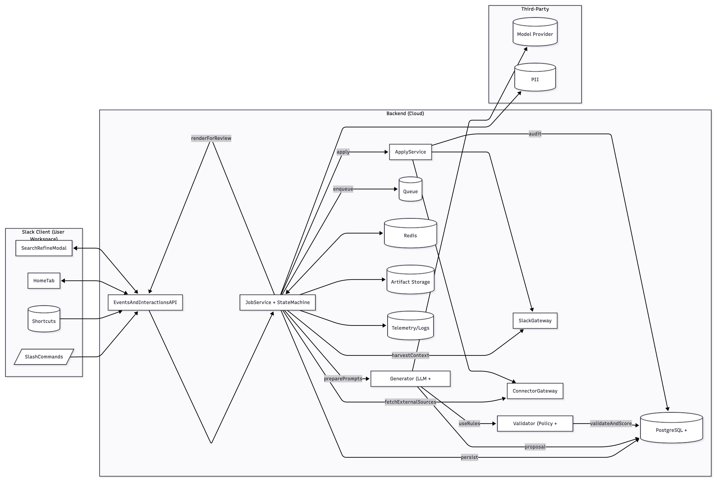
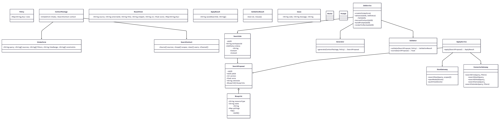
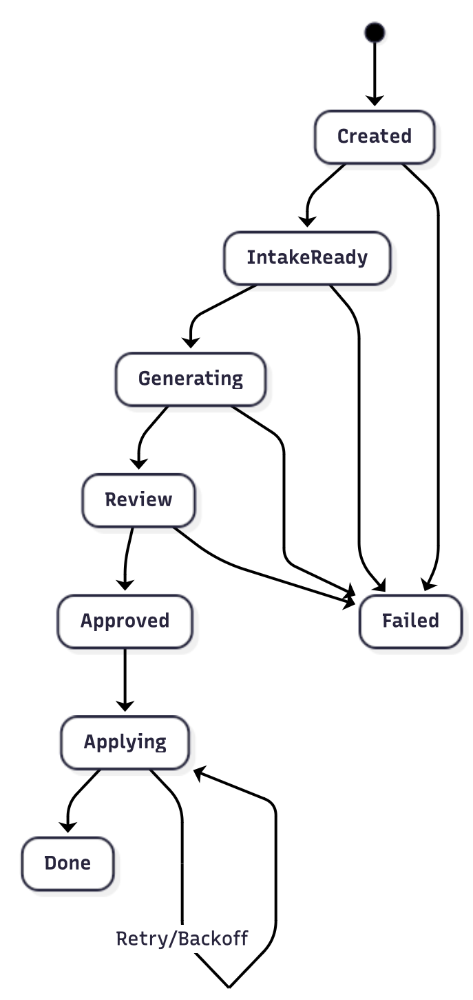
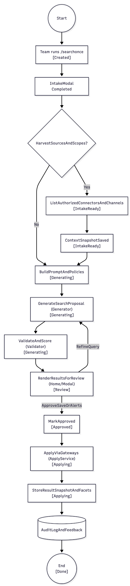
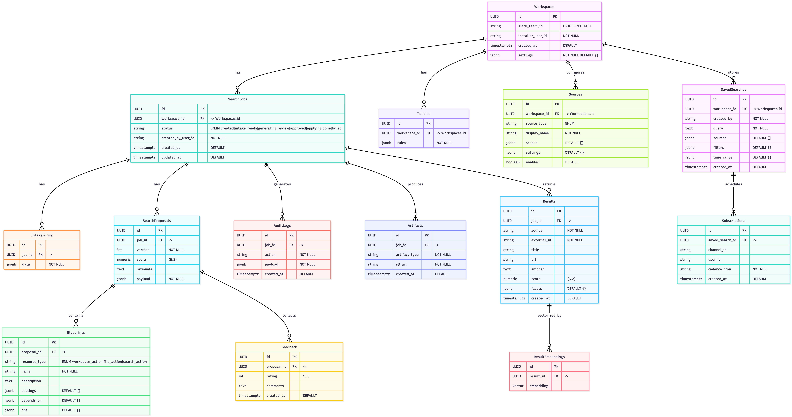

# User Story 3

Authors: Akeil Smith, Lexi Kronowitz, Miguel Almeida

Version/Date: v4.0 — 2025-10-31

## 1. Header
Title: Cross-Workspace “Search Once” — Simplified v1 (User Story #3)

User Story:
As students or team members under time pressure, the team wants Slack to support a cross-workspace “search once” capability so that anyone can quickly find files or messages across connected workspaces and platforms without guessing where to look.
Outcome:

A unified search experience that queries multiple connected sources (Slack channels, DMs, files, and approved external connectors), ranks results semantically, and lets users refine, save, and share searches from within Slack with optional alerts and subscriptions.

Primary KPIs:
Time to first relevant result < 3 s
Top-1 precision ≥ 0.6
Top-5 recall ≥ 0.85
Saved-search reuse rate ≥ 40 %
User satisfaction (CSAT ≥ 4 / 5)

## 2. Architecture Diagram

flowchart LR
  subgraph SlackClient[Slack Client (User Workspace)]
    H[HomeTab]
    M[SearchRefineModal]
    SC[/SlashCommands/]
    SHT[(Shortcuts)]
  end

  subgraph Backend[Backend (Cloud)]
    API[EventsAndInteractionsAPI]
    JobService[JobService + StateMachine]
    Generator[Generator (LLM + Heuristics)]
    Validator[Validator (Policy + Quality)]
    ApplyService[ApplyService]
    SlackGateway[SlackGateway]
    ConnectorGateway[ConnectorGateway]
    DB[(PostgreSQL + pgvector)]
    Queue[(Queue)]
    Redis[(Redis Cache/Locks)]
    S3[(Artifact Storage)]
    Observability[(Telemetry/Logs)]
  end

  subgraph ThirdParty[Third-Party]
    LLM[(Model Provider)]
    DLP[(PII Redaction)]
  end

  SC --> API
  SHT --> API
  H <--> API
  M <--> API

  API --> JobService
  JobService -->|persist| DB
  JobService -->|enqueue| Queue
  JobService -->|harvestContext| SlackGateway
  JobService -->|fetchExternalSources| ConnectorGateway
  JobService -->|preparePrompts| Generator
  Generator -->|useRules| Validator
  Generator --> LLM
  Generator -->|proposal| DB
  Validator -->|validateAndScore| DB
  JobService -->|renderForReview| API
  JobService -->|apply| ApplyService
  ApplyService --> SlackGateway
  ApplyService --> ConnectorGateway
  ApplyService -->|audit| DB
  JobService --> S3
  JobService --> Observability
  JobService <--> Redis
  JobService --> DLP

Explanation:
When the team runs a search from Slack (via slash command or shortcut), the request reaches the EventsAndInteractionsAPI, which starts a SearchJob handled by the JobService. It collects context from Slack and external sources (Drive, Gmail, GitHub, etc.), builds a prompt for the Generator, and calls the LLM to create a federated search plan. The Validator checks policies and privacy rules before results are shown for review. Once approved, the ApplyService saves the search and sets alerts. Redis holds temporary state, S3 stores artifacts, and Observability logs events. The DLP layer removes sensitive data before model use.
Information Flow: Trigger → Intake → ContextHarvest → Generation → Validation → Review → Approval → Apply → Audit

## 3. Class Diagram

classDiagram
  class SearchJob {
    +UUID id
    +String workspaceId
    +JobStatus status
    +String createdByUserId
    +Instant createdAt
    +Instant updatedAt
  }

  class SearchProposal {
    +UUID id
    +UUID jobId
    +int version
    +float score
    +String rationale
    +Blueprint[] blueprints
  }

  class Blueprint {
    +String resourceType
    +String name
    +String description
    +Map settings
    +Op[] ops
    +UUID[] dependsOn
  }

  class Policy { +Map~String,Any~ rules }
  class ContextPackage { +IntakeForm intake; +SearchContext context }
  class IntakeForm { +String query; +String[] sources; +String[] filters; +String timeRange; +String[] constraints }
  class SearchContext { +Source[] sources; +Scope[] scopes; +User[] users; +Channel[] channels }
  class ResultItem { +String source; +String externalId; +String title; +String snippet; +String url; +float score; +Map~String,Any~ facets }
  class ApplyResult { +String savedSearchId; +String[] subscriptions }
  class ValidationResult { +bool ok; +Issue[] issues }
  class Issue { +String code; +String message; +String severity }
  class Blocks
  class Prompt

  class JobService {
    +create(IntakeForm)
    +advance(UUID, JobStatus)
    +fail(UUID, String)
    +harvestContext(UUID)
    +buildPrompt(UUID)
    +renderForReview(UUID)
  }

  class Generator { +generate(ContextPackage, Policy): SearchProposal }
  class Validator {
    +validate(SearchProposal, Policy): ValidationResult
    +score(SearchProposal): float
  }
  class ApplyService { +apply(SearchProposal): ApplyResult }
  class SlackGateway {
    +searchSlack(query, scopes[])
    +openModal(blocks)
    +pushView(blocks)
  }
  class ConnectorGateway {
    +searchDrive(query, filters)
    +searchGmail(query, filters)
    +searchGitHub(query, filters)
    +searchCanvas(query, filters)
    +searchCalendar(query, filters)
  }

  SearchJob --> SearchProposal
  SearchProposal o-- Blueprint
  ContextPackage --> IntakeForm
  ContextPackage --> SearchContext
  JobService --> SearchJob
  JobService --> Generator
  JobService --> Validator
  ApplyService --> SearchProposal
  ApplyService --> SlackGateway
  ApplyService --> ConnectorGateway

Explanation:
Each class has a defined purpose: SearchJob tracks status, SearchProposal stores plans, and Blueprint describes actions. The Generator creates plans via LLM logic; Validator checks rules; ApplyService executes through Slack and connector gateways. Shared types mirror User Stories 1 and 2 for consistency.

## 4. List of Classes

The system architecture consists of several key classes that collectively manage the end-to-end search process, from job initiation to policy validation and execution across connected services:

SearchJob – Tracks the overall search workflow, including its current status and assigned ownership.

SearchProposal – Stores the LLM-generated federated search plan and its associated confidence score.

Blueprint – Defines the ordered sequence of search actions and their dependencies.

Policy – Contains privacy, access, and scope rules used to validate search operations.

ContextPackage – Merges user inputs with relevant contextual data from connected sources.

ResultItem – Provides a standardized structure for representing results across multiple platforms.

ApplyResult – Logs and records identifiers for saved searches and ongoing subscriptions.

JobService – Serves as the orchestrator that coordinates the full job execution lifecycle.

Generator – Leverages the LLM to dynamically generate search plans based on context and intent.

Validator – Verifies that generated plans comply with all policy and quality requirements.

ApplyService – Executes validated plans through appropriate data gateways.

SlackGateway – Handles Slack-specific UI rendering and search integration within the workspace.

ConnectorGateway – Interfaces with external systems such as Google Drive, Gmail, GitHub, Canvas, and Calendar.

Blocks / Prompt – Define both the Slack UI block layouts and the LLM instruction templates used during generation.

## 5. State Diagram

stateDiagram-v2
  [*] --> Created
  Created --> IntakeReady
  IntakeReady --> Generating
  Generating --> Review
  Review --> Approved
  Approved --> Applying
  Applying --> Done
  Created --> Failed
  IntakeReady --> Failed
  Generating --> Failed
  Review --> Failed
  Applying --> Applying : Retry/Backoff

Explanation:
The job follows a linear sequence with an approval gate. Failures can retry without data loss, matching the lifecycle pattern in other stories.

## 6. Flow Chart

Scenario Label: SC3 — Cross-Workspace Search Once
flowchart TD
  Start((Start)) --> A[Team runs "/searchonce"\n[Created]]
  A --> B[IntakeModal Completed\n[IntakeReady]]
  B --> C{HarvestSourcesAndScopes?}
  C -- Yes --> D[ListAuthorizedConnectorsAndChannels\n[IntakeReady]]
  C -- No --> G[BuildPromptAndPolicies\n[Generating]]
  D --> E[ContextSnapshotSaved\n[IntakeReady]]
  E --> G
  G --> H[GenerateSearchProposal (Generator)\n[Generating]]
  H --> I[ValidateAndScore (Validator)\n[Generating]]
  I --> J[RenderResultsForReview (Home/Modal)\n[Review]]
  J -- ApproveSaveOrAlerts --> JA[MarkApproved\n[Approved]]
  JA --> K[ApplyViaGateways (ApplyService)\n[Applying]]
  J -- RefineQuery --> H
  K --> L[StoreResultSnapshotAndFacets\n[Applying]]
  L --> M[(AuditLogAndFeedback)]
  M --> Done((End\n[Done]))

Explanation:
The user submits a query; the system collects context and authorization, builds a federated plan, validates it, and presents ranked results for review. Approved plans save searches and set alerts. All steps emit auditable logs.

## 7. Development Risks and Failures

The following risks have been identified for the project, each evaluated for probability, impact, and corresponding mitigation strategies. These risks encompass delays, model performance, user adoption, data security, and integration reliability.

App Review Delays – Slack and connector approval processes may delay release timelines.
Probability: Medium | Impact: Medium
Mitigation: Prepare detailed scope documentation early and run a controlled private beta to gather validation.

Model Cost/Latency – LLM-based ranking could increase processing time or operational cost.
Probability: Medium | Impact: High
Mitigation: Implement prompt caching and stream partial results to maintain responsiveness.

Policy Variance – Different Slack workspaces may have inconsistent source permissions.
Probability: High | Impact: Medium
Mitigation: Develop configurable templates and visible badges to adapt rules across environments.

Testing Realism – Limited access to live datasets before launch could reduce test accuracy.
Probability: Medium | Impact: Medium
Mitigation: Generate synthetic workspaces and use benchmark datasets to simulate real-world conditions.

Adoption Risk – Users may be skeptical about result coverage or ranking accuracy.
Probability: High | Impact: High
Mitigation: Communicate ranking logic transparently and provide in-app feedback mechanisms.

Slack API Rate Limits – High request volumes may trigger Slack throttling.
Probability: Medium | Impact: Medium
Mitigation: Queue and throttle requests intelligently to comply with rate limits.

Insufficient Permissions – Missing or expired connector authorizations may block operations.
Probability: Low | Impact: High
Mitigation: Implement guided OAuth flows and fallback handling for limited-access scenarios.

Low-Quality Proposals – LLM may generate incomplete or irrelevant search plans.
Probability: Medium | Impact: Medium
Mitigation: Introduce validator filters and optional manual review for plan refinement.

Security / PII Leakage – Prompts or results could inadvertently include sensitive information.
Probability: Low | Impact: High
Mitigation: Apply data loss prevention (DLP) masking and encrypt all data at rest and in transit.

Change Management – Users may expect complete coverage of all data sources upon launch.
Probability: Medium | Impact: Medium
Mitigation: Display source badges and coverage indicators to set clear expectations.

## 8. Technology Stack
Language/Runtime: TypeScript (Node.js 20)

Frameworks: Bolt for Slack (Events & Interactivity), Fastify (REST API)

Infrastructure: AWS Lambda + API Gateway (or Cloud Run), SQS, CloudWatch/X-Ray or OpenTelemetry for end-to-end observability

Data: PostgreSQL + pgvector, Redis, S3

AI: GPT-5 LLM with JSON schema validation (structured, deterministic outputs for safe integration)

CI/CD: GitHub Actions, Terraform (Infrastructure as Code)

Testing: Jest (unit), Pact (contract), Playwright (UI flows), k6 (load & apply-phase)

## 9. APIs
Incoming Slack
POST /slack/events — Verifies URL; receives events and routes to handlers.
POST /slack/interactions — Handles view submissions, buttons, and block actions.
Internal REST
POST /search/jobs — Creates a SearchJob; returns { jobId }.
GET /search/jobs/{id} — Returns job status and proposal.
POST /search/jobs/{id}/harvest — Collects connector context.
POST /search/jobs/{id}/generate — Runs Generator; returns SearchProposal.
POST /search/jobs/{id}/validate — Runs Validator; returns ValidationResult.
POST /search/proposals/{id}/approve — Marks proposal approved.
POST /search/proposals/{id}/apply — Executes ApplyService.
POST /search/proposals/{id}/feedback — Stores user feedback.
Service Interfaces
JobService: create(), advance(), fail(), harvestContext(), buildPrompt(), renderForReview().
Generator: generate(ctx, policy).
Validator: validate(), score().
ApplyService: apply().
SlackGateway: searchSlack(), openModal(), pushView().
ConnectorGateway: searchDrive(), searchGmail(), searchGitHub(), searchCanvas(), searchCalendar().

## 10. Public Interfaces
Slash Command: /searchonce → Opens Intake Modal; creates job on submit.
Shortcut: “Search once from thread” → Seeds IntakeForm with inferred keywords.
Home Tab: Displays recent/saved searches and “New Search” CTA.
Modals:
Intake Modal: User inputs query, sources, filters.
Review Modal: Shows ranked results with save/alert toggles.
Confirmation Modal: Shows summary and connector call counts.

## 11. Data Schemas (SQL DDL)

erDiagram
    Workspaces ||--o{ SearchJobs : has
    SearchJobs ||--o{ IntakeForms : has
    SearchJobs ||--o{ SearchProposals : has
    SearchProposals ||--o{ Blueprints : contains
    Workspaces ||--o{ Policies : has
    SearchJobs ||--o{ AuditLogs : generates
    SearchProposals ||--o{ Feedback : collects
    SearchJobs ||--o{ Artifacts : produces
    Workspaces ||--o{ Sources : configures
    SearchJobs ||--o{ Results : returns
    Results ||--o{ ResultEmbeddings : vectorized_by
    Workspaces ||--o{ SavedSearches : stores
    SavedSearches ||--o{ Subscriptions : schedules

    Workspaces {
      UUID id PK
      string slack_team_id "UNIQUE NOT NULL"
      string installer_user_id "NOT NULL"
      timestamptz created_at "DEFAULT now()"
      jsonb settings "NOT NULL DEFAULT {}"
    }

    SearchJobs {
      UUID id PK
      UUID workspace_id FK "-> Workspaces.id"
      string status "ENUM created|intake_ready|generating|review|approved|applying|done|failed"
      string created_by_user_id "NOT NULL"
      timestamptz created_at "DEFAULT now()"
      timestamptz updated_at "DEFAULT now()"
    }

    IntakeForms {
      UUID id PK
      UUID job_id FK "-> SearchJobs.id"
      jsonb data "NOT NULL"
    }

    SearchProposals {
      UUID id PK
      UUID job_id FK "-> SearchJobs.id"
      int version "NOT NULL"
      numeric score "(5,2)"
      text rationale
      jsonb payload "NOT NULL"
    }

    Blueprints {
      UUID id PK
      UUID proposal_id FK "-> SearchProposals.id"
      string resource_type "ENUM workspace_action|file_action|search_action"
      string name "NOT NULL"
      text description
      jsonb settings "DEFAULT {}"
      jsonb depends_on "DEFAULT []"
      jsonb ops "DEFAULT []"
    }

    Policies {
      UUID id PK
      UUID workspace_id FK "-> Workspaces.id"
      jsonb rules "NOT NULL"
    }

    AuditLogs {
      UUID id PK
      UUID job_id FK "-> SearchJobs.id"
      string action "NOT NULL"
      jsonb payload "NOT NULL"
      timestamptz created_at "DEFAULT now()"
    }

    Feedback {
      UUID id PK
      UUID proposal_id FK "-> SearchProposals.id"
      int rating "1..5"
      text comments
      timestamptz created_at "DEFAULT now()"
    }

    Artifacts {
      UUID id PK
      UUID job_id FK "-> SearchJobs.id"
      string artifact_type "NOT NULL"
      string s3_uri "NOT NULL"
      timestamptz created_at "DEFAULT now()"
    }

    Sources {
      UUID id PK
      UUID workspace_id FK "-> Workspaces.id"
      string source_type "ENUM slack|drive|gmail|github|canvas|calendar"
      string display_name "NOT NULL"
      jsonb scopes "DEFAULT []"
      jsonb settings "DEFAULT {}"
      boolean enabled "DEFAULT true"
    }

    Results {
      UUID id PK
      UUID job_id FK "-> SearchJobs.id"
      string source "NOT NULL"
      string external_id "NOT NULL"
      string title
      string url
      text snippet
      numeric score "(5,2)"
      jsonb facets "DEFAULT {}"
      timestamptz created_at "DEFAULT now()"
    }

    ResultEmbeddings {
      UUID id PK
      UUID result_id FK "-> Results.id"
      vector embedding
    }

    SavedSearches {
      UUID id PK
      UUID workspace_id FK "-> Workspaces.id"
      string created_by "NOT NULL"
      text query "NOT NULL"
      jsonb sources "DEFAULT []"
      jsonb filters "DEFAULT {}"
      jsonb time_range "DEFAULT {}"
      timestamptz created_at "DEFAULT now()"
    }

    Subscriptions {
      UUID id PK
      UUID saved_search_id FK "-> SavedSearches.id"
      string channel_id
      string user_id
      string cadence_cron "NOT NULL"
      timestamptz created_at "DEFAULT now()"
    }

## 12. Security and Privacy
Least-Privilege Scopes: Request minimal Slack and connector permissions.
Data Minimization: Store only metadata; anonymize names.
Encryption & Secrets: TLS + AES-256 via KMS; secrets in Secrets Manager.
Access Controls: Per-workspace tokens and immutable audit logs.
Retention: Default 30 days; configurable by admins.
DLP Option: Redacts PII before LLM use.
Guardrails: Validator enforces source allowlists and privacy scopes.

## 13. Risks to Completion
Several factors may affect timely completion and successful deployment of the project. Each identified risk includes its assessed probability, potential project impact, and corresponding mitigation strategy.

App Review & Distribution – Slack and connector approval processes could delay the public release timeline.
Probability: Medium | Impact: Medium
Mitigation: Prepare all documentation, scope details, and screenshots early, and conduct a private beta to validate functionality prior to submission.

Model Cost/Latency – LLM processing may introduce additional cost or response delays during query generation.
Probability: Medium | Impact: High
Mitigation: Implement prompt caching, batch processing, and continuous prompt optimization to improve efficiency and control costs.

Customer Policy Variance – Different workspaces may enforce unique privacy or access policies that affect behavior.
Probability: High | Impact: Medium
Mitigation: Build configurable templates and a workspace-level policy editor to support flexible compliance.

Testing Realism – Limited access to production-level data could reduce the accuracy of pre-launch validation.
Probability: Medium | Impact: Medium
Mitigation: Use synthetic datasets and golden query benchmarks to ensure realistic test coverage.

Adoption Risk – Users may be hesitant to trust AI-driven ranking or automated search aggregation.
Probability: High | Impact: High
Mitigation: Prioritize transparent UX, show explainable ranking logic, and enable direct feedback channels to build confidence.

## Chat GPT Chatlogs: 

- https://chatgpt.com/share/690140e9-ee64-800a-a2dd-8cca0904fd45
- https://chatgpt.com/share/6904f85f-a00c-800d-8a56-13c59fdac253 